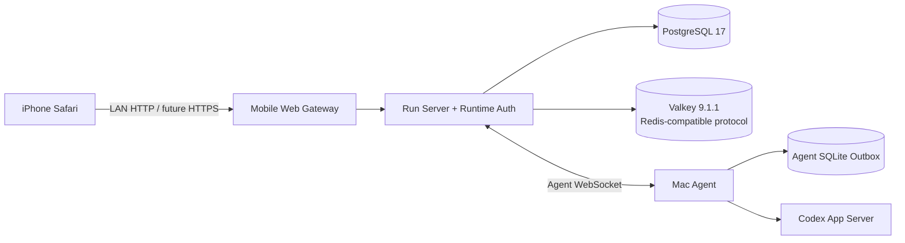

# Codex Remote

> [!abstract] 产品定位
> 手机是 Codex 的远程工作台，Mac 是本地执行机器。系统传递任务、状态与结果，不远程接管屏幕、鼠标或键盘。

## 当前阶段

| 范围 | 状态 | 结论 |
| --- | --- | --- |
| 局域网 Mobile Web | 可用里程碑 | iPhone Safari 单标签真机闭环已通过 |
| Homebrew Runtime `0.2.0-beta.1` | 已发现阻塞缺陷 | 默认 `Application Support` 路径未转义，Valkey 无法启动；不得继续推荐 |
| Homebrew Runtime `0.2.0-beta.2` | 修复版已发布 | Valkey 配置转义与失败回滚已修复；远程升级后 63800 恢复监听 |
| Homebrew Runtime `0.2.0-beta.3` | 已发布 | 五个登录项收敛为一个 `com.codex-remote.runtime` Supervisor |
| 第三方 Homebrew Tap | Beta 可安装 | Formula 与 GitHub prerelease 已更新到 `beta.3` |
| 官方短命令 `brew install codex-remote` | 未获得 | 当前仍通过第三方 Tap 安装；官方 Homebrew 分发另行申请 |
| 公网访问 | 未交付 | 临时随机域名不满足可靠性要求；稳定 Origin、容量和恢复方案另行设计 |
| 原生 iPhone Runtime 迁移 | 未交付 | 当前 iPhone App 仍使用旧 WebSocket 数据通道 |
| Admin/Diagnostics | 独立演进 | 不属于 Homebrew 用户 Runtime |

当前产物、`beta.1` 事故与修复证据见 [[0.2.0 Homebrew 发布候选]]。Beta 允许在明确披露后跳过签名和公证，但默认 macOS 状态路径的真实 Setup 必须成为发布门禁。

## 仓库边界

| 仓库 | 职责 | Homebrew Runtime |
| --- | --- | --- |
| `mobile-web` | 用户界面、Gateway、Mobile Web 真机验收 | 是 |
| `relay-server` | Relay、Run Server、Auth、迁移与协议 | 是 |
| `mac-agent` | Codex App Server 适配和本地执行 | 是 |
| `iphone-app` | 原生 iPhone 客户端 | 否 |
| `admin-platform` | Admin、Diagnostics 与 Collector | 否 |
| `runtime-distribution` | CLI、Supervisor、组装、Manifest 与安装测试 | 是 |
| `homebrew-tap` | 第三方 Homebrew Formula 与公开 Runtime Release 资产 | Formula + 二进制 |

这些目录是独立 Git 仓库。跨仓库只通过版本化 Schema、Fixtures、Manifest 和兼容记录协作，不导入兄弟仓库源码。

## GitHub 组织边界

GitHub owner 为 [`codex-remote`](https://github.com/codex-remote)。当前仓库状态如下：

| 可见性 | 仓库 | 当前状态 |
| --- | --- | --- |
| Public | `homebrew-tap` | 第三方 Formula 安装元数据与不可变 Runtime Release 资产 |
| Public | `docs` | 产品、架构、协议和发布知识库 |
| Public | `runtime-distribution`、`relay-server`、`mac-agent`、`mobile-web`、`iphone-app`、`admin-platform` | Apache-2.0 实现源码 |

当前原则是“源码、架构文档和分发元数据公开，运行凭据和用户数据保持私有”。各仓库采用 Apache-2.0，并通过版本化契约独立演进。已经发布的历史 Beta 二进制保留原许可；未来 Stable 与官方分发只使用签名、公证且通过发布门禁的构建产物。

## 当前 Runtime

- PostgreSQL 保存 Runtime 权威状态。
- Valkey 只承载活跃事件、通知和 Presence；它可重建，不是历史事实源。
- Mac Agent 在本地 SQLite 中保存去重、检查点和未确认结果。
- 浏览器只访问 Gateway，不直连 PostgreSQL、Valkey、Agent 或 Admin API。

## 当前限制

- 仅支持 Apple Silicon macOS。
- 局域网 HTTP 按单 Safari 标签使用；双标签并发刷新会触发安全重放撤销。
- `410 CURSOR_EXPIRED`、公网限流、多实例、长期压力与灾难恢复尚未完成。
- 公开 Beta 二进制许可证和自动生成的 `THIRD_PARTY_NOTICES` 已建立，仍需正式法律审查。
- 无 Developer ID Application 身份和 notarization profile 时不得发布稳定 Runtime。

## 下一放行点

1. 由用户从外部 Terminal 升级到 `0.2.0-beta.3` 并运行 `codex-remote setup --repair`。
2. 验证旧五项已移除、系统设置只保留一个 Codex Remote，并完成 Doctor 与配对。
3. 完成干净 Apple Silicon Mac 的第三方 Tap 安装、升级、回滚与真机复验。
4. 注册 Apple Developer Program 后完成 Developer ID 签名和 Apple 公证，准备 Stable。
5. Stable 后提交 Homebrew 官方 Cask，获得干净机器上的 `brew install codex-remote`。

## 关键文档

- [[系统总体架构]]
- [[Codex Remote 系统架构.canvas|系统架构 Canvas]]
- [[Mobile Web Gateway 与 Runtime 鉴权架构]]
- [[可靠多端会话与运行时控制面升级方案]]
- [[Runtime PostgreSQL 数据表规范]]
- [[Runtime SQLite 与 Valkey 数据结构规范]]
- [[Run Server HTTPS 与 SSE 接口规范]]
- [[Run Server JSON 轮询接口规范]]
- [[Runtime JSON 轮询传输架构]]
- [[ADR-009 Runtime JSON 轮询作为非 SSE 兼容传输]]
- [[发布与版本策略]]
- [[0.2.0 Homebrew 发布候选]]

历史 iPhone MVP 范围仅见 [[MVP 版本定义]]；旧实现计划不再作为当前入口。
