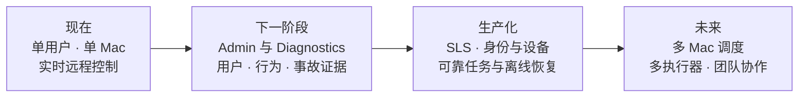

# Codex Remote

> [!abstract] 随身携带的 AI 编程控制台
> **iPhone 是遥控器，Mac 是执行机器，Codex 是完成工作的 AI 程序员。** 你不必一直坐在电脑前，也能选择本地项目、继续已有会话、下达开发指令，并实时掌握执行过程与代码结果。

| 随时发起 | 过程可见 | 结果可查 | 代码留在 Mac |
| --- | --- | --- | --- |
| 从 iPhone 提交开发指令 | 实时查看 Codex 输出与运行状态 | 查看完成状态、修改文件和 Git Diff | 项目与执行环境仍在自己的电脑上 |

## 产品定位

Codex Remote 是面向开发者的 **AI 编程远程控制台**。它连接 iPhone 与 Mac 上已经存在的 Codex 工作环境，让用户可以离开工位后继续管理真实的开发任务。

它传递的是 **项目、会话、指令、状态和结果**，不是桌面画面、鼠标与键盘。用户关注的是“让 Codex 完成什么、现在进行到哪里、最终改了什么”，而不是在手机的小屏幕上远程操作一台电脑。

> [!info] 一句话区分
> 远程桌面把 Mac 屏幕缩进手机；Codex Remote 把 AI 开发工作流重新设计成适合手机操作的控制面。

## 解决什么问题

### 人必须守在电脑旁

Codex 可以持续执行分析、修改与验证，但传统使用方式要求开发者留在 Mac 前发起下一步、观察输出或停止异常任务。等待过程占用了人的时间，也限制了 AI 编程工具的使用场景。

**Codex Remote 的解决方式：** 把任务发起、状态查看、中断和结果回顾放到 iPhone，让开发者可以在通勤、会议间隙或离开工位时继续掌控任务。

### 手机远程桌面不适合编程

远程桌面强调像素和输入设备映射。在手机上缩放终端、定位光标、操作菜单，不仅效率低，也很难快速判断一个 AI 任务是否正常。

**Codex Remote 的解决方式：** 用 Project、Thread、Turn 组织交互。用户直接选择项目和会话，输入自然语言指令，界面只呈现对决策有用的进度、日志与结果。

### 多项目与历史会话难以延续

真实开发工作通常跨越多个 Git 仓库，也需要在已有上下文中继续对话。简单的远程命令入口既不了解项目边界，也无法自然恢复 Codex 会话。

**Codex Remote 的解决方式：** 由 Mac Agent 发现允许访问的 Git 项目，并通过 Codex App Server 读取和继续原有 Thread。手机不需要知道本地绝对路径，也不会另建一套会话历史。

### 执行结果缺少可控性

只收到一句“完成了”不足以判断开发任务是否可信。开发者需要知道当前是否仍在运行、能否停止、修改了哪些文件，以及代码差异是什么。

**Codex Remote 的解决方式：** 实时返回 assistant、stdout、stderr 和运行状态，并在结束后展示修改文件与 Git Diff 摘要。

## 为谁设计

| 用户 | 典型需要 | 获得的价值 |
| --- | --- | --- |
| 独立开发者 | 在个人 Mac 上同时维护多个项目 | 碎片时间也能推进清晰、可检查的开发任务 |
| AI 编程重度用户 | Codex 长时间运行时需要离开电脑 | 随时查看进度、停止执行并承接下一轮指令 |
| 小型研发团队成员 | 在可信网络内使用固定开发机器 | 保留本地工具链与仓库环境，减少远程操作成本 |
| 移动办公开发者 | 通勤或会议间隙无法打开 Mac | 用适合手机的交互完成任务管理，而非操作桌面 |

## 典型使用场景

### 场景一：离开工位后继续任务

下班前让 Codex 开始重构一个模块，途中从 iPhone 查看运行输出。任务完成后检查修改文件和 Diff，再决定是否补充测试或开始下一轮。

### 场景二：利用碎片时间处理小任务

在排队或通勤时选择对应项目，提交“补充这个接口的边界测试”或“分析失败日志并给出修复”。回到电脑前时，代码修改和执行结果已经可供检查。

### 场景三：远程观察耗时执行

Codex 正在运行较长的测试、构建或代码分析。用户无需保持远程桌面连接，只需查看结构化输出；发现方向错误时可以立即中断。

### 场景四：继续已有 Codex 会话

用户选择某个 Git 项目，再打开之前的 Thread。Codex 保留原有对话上下文，开发者可以直接说“继续刚才的方案，并修复剩余测试”，不必重新解释背景。

### 场景五：管理多个本地项目

同一台 Mac 上存在多个仓库时，用户从手机查看项目列表，并在明确的项目边界内启动任务。系统不接受手机传入任意绝对路径，降低误操作风险。

## 如何工作

1. Mac Agent 只发现预先允许的工作区中的 Git 项目。
2. iPhone 选择 Project，并创建或继续一个 Codex Thread。
3. 用户提交一次自然语言指令，启动一个 Turn。
4. Relay 在 iPhone 与 Mac Agent 之间实时转发消息，不执行代码。
5. Codex 在 Mac 的真实项目与工具链中工作，过程持续回传到手机。
6. 任务结束后，手机展示最终状态、修改文件与 Git Diff 摘要。

## 核心能力

| 能力 | 产品表现 |
| --- | --- |
| 项目选择 | 列出 Mac 授权工作区内的多个 Git 项目 |
| 会话延续 | 查看 Codex 历史 Thread，新建或继续会话 |
| 自然语言任务 | 从 iPhone 向选定项目提交开发指令 |
| 实时反馈 | 展示 assistant、stdout、stderr 与执行状态 |
| 运行控制 | 在方向错误或执行异常时停止当前 Turn |
| 结果检查 | 查看完成、失败或中断状态，以及修改文件和 Git Diff |
| 自动重连 | iPhone 与 Mac Agent 断线后自动恢复连接与当前状态 |
| 执行档位 | 在 App Server 允许范围内选择只读、工作区或完整权限 |

## 产品价值

> [!success] 从“坐在终端前使用 AI”到“随时调度 AI 完成开发工作”

- **释放等待时间：** AI 执行期间，人可以离开电脑处理其他事情。
- **扩大工作场景：** 通勤、会议间隙和临时离开工位时仍可推进开发。
- **保留上下文：** 继续 Mac 上原有的 Codex Thread，不重复描述项目背景。
- **降低移动操作成本：** 手机只呈现任务控制所需的信息，不复制桌面界面。
- **保留本地环境：** 代码、Git 仓库、依赖和工具链仍由 Mac 承载。
- **提高可控性：** 执行过程可见、可以中断、结果可检查。

## 与常见方案的区别

| 对比维度 | Codex Remote | 远程桌面 | 云端 AI 编程环境 |
| --- | --- | --- | --- |
| 交互对象 | 开发任务、会话与结果 | Mac 桌面画面 | 云端仓库与运行环境 |
| 手机体验 | 针对任务控制设计 | 依赖缩放、鼠标与键盘映射 | 取决于 Web IDE 的移动适配 |
| 执行位置 | 自己的 Mac | 自己的 Mac | 云端容器或远程主机 |
| 本地上下文 | 直接使用现有仓库与 Codex Thread | 完整但操作笨重 | 通常需要同步或重建环境 |
| 网络传输重点 | 结构化消息与日志 | 连续屏幕图像 | 源码、构建和云端状态 |
| 核心价值 | 随时调度和监督 AI 开发任务 | 完整操作远程电脑 | 提供托管开发环境 |

## 当前产品边界

> [!warning] 当前为 Unreleased MVP
> 现阶段适合个人开发和可信私有网络内验证，尚不是可直接暴露到公网的生产服务。

**当前已经覆盖：**

- 单用户、单台 Mac、多个 Git 项目和多个 Codex Thread。
- 创建或继续会话、启动 Turn、实时输出、中断和结果摘要。
- Relay 与 Mac Agent 自动重连，以及运行中 Turn 的有限状态恢复。
- Simulator 与 iPhone 真机调试流程。

**当前明确不做：**

- 用户登录、应用层鉴权、设备配对和权限管理。
- 多 Mac 路由、离线任务、可靠队列和服务端执行历史。
- 自动提交、推送、创建 Pull Request 或部署。
- 允许手机传入任意本地路径或任意 Shell 命令。

当前 Relay 没有应用层鉴权，只能运行在可信局域网、Tailscale 或等价私有网络中。完整范围与验收标准见 [[MVP 版本定义]]。

## 产品演进

当前阶段首先验证最重要的产品假设：**开发者是否愿意用手机调度和监督运行在自己 Mac 上的 AI 程序员。** 下一阶段通过独立 Admin Platform 建立服务状态、用户、行为和诊断证据管理；Relay 继续专注实时通信。随后再逐步加入鉴权、设备管理、持久化任务、多 Mac 与可靠投递，而不改变“手机负责控制，Mac 负责执行”的核心体验。

## 核心主张

> [!quote]
> 不把电脑塞进手机，而是把 AI 编程的控制权放进口袋。

Codex Remote 让开发者从“必须守在电脑旁”转向“在需要时发起、监督和验收任务”。Mac 继续提供完整、私有且熟悉的开发环境；iPhone 则成为连接人和 AI 程序员的轻量控制台。
