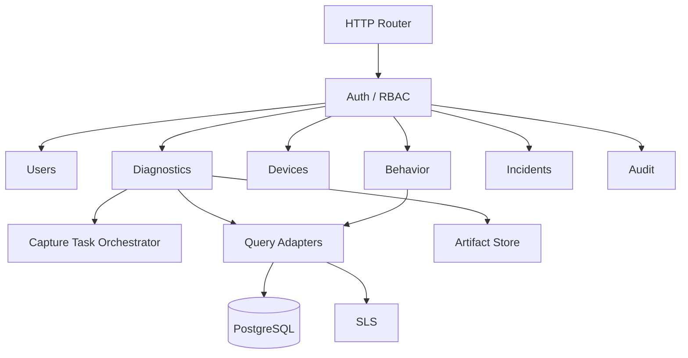

# Admin 与可观测平台架构

## 1. 产品定位

CodexRemote Admin Platform 是独立于 Relay 的后台管理与可观测平台。Diagnostics 是第一个交付模块，但平台边界从第一阶段就覆盖未来的用户信息、用户行为、设备、事故、审计和系统设置。

```text
CodexRemote Admin Platform
├── Overview
├── Users
├── Sessions
├── User Activity
├── Devices
├── Diagnostics
│   ├── Events
│   ├── Incidents
│   ├── Captures
│   └── Artifacts
├── Services
├── Audit
└── Settings
```

> [!important] 独立服务边界
> Diagnostics API 是 Admin Server 的模块，与 Admin Web 由同一个服务交付；它不是 Relay Server 的接口。Diagnostics Collector 与 Admin Server 同仓，但运行成独立进程。

## 2. 部署单元

| 部署单元 | 说明 | 扩缩容依据 |
| --- | --- | --- |
| Admin Server | Admin API、Diagnostics API、用户、权限、查询、任务编排 | 管理请求、查询并发 |
| Admin Web | 由 Admin Server 提供的静态资源或独立 CDN 资源 | 页面资源流量 |
| Diagnostics Collector | 文件采集、CoreDevice、上传重试 | 日志吞吐、连接设备数 |
| PostgreSQL | 权威业务和审计元数据 | 事务与关系查询 |
| SLS | 技术日志、行为、指标、Trace | 数据摄入和查询量 |
| Object Storage | 诊断附件 | 容量与下载流量 |

第一阶段 Admin Server 使用模块化单体。只有模块出现独立容量、权限、故障隔离或发布周期需求时才拆为独立服务。

## 3. 服务内部模块



摄入路由、查询路由和设备操作路由必须分区：

- `/api/ingest/*`：服务和移动端批量摄入，使用写入专用凭据。
- `/api/admin/*`：用户、行为、诊断和审计查询，使用管理员身份与 RBAC。
- `/api/collector/*`：Collector 领取和回报白名单任务，使用设备级双向身份。
- `/artifacts/*`：短期授权下载，所有访问进入审计。

具体路径由实现阶段的 API 设计确定，上述分区是安全边界，不是已经发布的契约。

## 4. 页面信息架构

页面的正式路由、布局、视觉系统、前端技术边界和一次性替换规则以 [[Admin Web 产品与前端架构]] 为准。本节描述平台能力边界，不再作为具体 UI 布局规格。

### Overview

- Relay、Mac Agent、Collector、SLS 和数据库状态。
- 最近错误、摄入延迟、待上传量和采集失败。
- iPhone 活跃版本、内存异常、崩溃与卡顿趋势。
- 用户活跃和关键行为只展示聚合值，不混入技术错误表。

### Users

- 用户基本信息、账号状态、设备和最近会话。
- 关联的行为时间线与诊断事故入口。
- 敏感字段按角色脱敏，查看完整内容写入审计。

### User Activity

- 稳定业务事件筛选、会话时间线、漏斗和版本对比。
- 行为属性来自注册 Schema，不解析技术日志正文。

### Diagnostics

- Events：按来源、级别、时间、事件名、Trace、Session、Turn 和版本筛选。
- Incidents：固定时间窗口、查询条件、附件和结论，形成可复查证据包。
- Captures：设备采集任务状态、发起人、命令类型、耗时和错误。
- Artifacts：MetricKit、Crash、sysdiagnose、App 导出包的 Manifest、大小和哈希。

当前已交付的能力进入 `Observability`、`Collection & Evidence` 和 `System`。Users 与 User Activity 是已确认方向，以不可点击的“规划中”显示；Audit、Settings 及其他低确定性能力完全隐藏。所有状态、显示和升级条件以 [[Admin 能力目录与导航策略]] 为准。

### Audit

- 管理员登录、用户查看、敏感字段解密、日志导出、附件下载、设备采集、设置变更。
- 审计事件禁止由普通日志保留策略自动删除。

## 5. 数据模型原则

### 用户资料

关系数据以 PostgreSQL 为权威来源，支持约束、状态变更和权限。日志中的 `user_id` 只是关联引用，不能替代用户表。

### 用户行为

行为事件使用业务语义，例如 `conversation.message_submitted`，包含稳定事件名和属性。禁止将自由文本 `message` 当成行为 Schema。

### 技术日志

技术日志描述系统状态和故障，例如 `relay.connection_failed`。内容必须结构化、脱敏、可采样，并与用户行为分别索引和授权。

### 事故

事故是不可变证据快照，至少包含：

- 事故 ID、标题、时间窗口、时区和创建人；
- 查询条件与数据源；
- 相关 `session_id`、`trace_id`、`turn_ref`、用户和设备引用；
- 事件快照、附件 Manifest、SHA-256 和 Schema 版本；
- 结论、根因状态、恢复与预防措施。

## 6. 权限模型

| 角色 | 主要权限 |
| --- | --- |
| `viewer` | 查看服务状态和脱敏技术日志 |
| `support` | 查看用户基本信息、会话和已有事故 |
| `engineer` | 查询技术事件、创建诊断采集和读取工程附件 |
| `admin` | 用户角色、系统设置和数据源配置 |
| `privacy` | 审批敏感数据查看、导出和保留例外 |

角色只是基线。实现时还需加入数据域、环境和租户范围，避免拥有一个角色就能查看全部用户或生产数据。

## 7. 本地与线上模式

| 能力 | 本地开发 | 线上 |
| --- | --- | --- |
| 管理元数据 | PostgreSQL | PostgreSQL |
| 技术日志 | 本地 JSONL 索引 | SLS |
| 用户行为 | Mock/本地小样本 | SLS |
| 诊断附件 | 本地目录 | 对象存储 |
| iPhone 上传 | Admin 局域网摄入 | SLS SDK + STS |
| CoreDevice | 可用，用户确认 | 不可用 |
| Admin 监听 | 默认 `127.0.0.1` | TLS 反向代理 |

开发与线上使用同一 PostgreSQL Schema 和迁移，但数据库、角色和凭据完全隔离。页面必须显示当前环境、日志数据源、时间范围和采集延迟。线上技术日志迁入 SLS 后，PostgreSQL 只保留控制面数据、事故快照和必要索引，不做原始日志长期双写。

## 8. AI 可读接口

AI 与人类读取相同的结构化证据，不通过解析页面 HTML：

- 版本化 JSON 查询 API；
- NDJSON 事件导出；
- Incident Snapshot JSON；
- Artifact Manifest 与 SHA-256；
- Schema Catalog；
- 查询时间、时区、数据源、脱敏级别和截断信息。

AI 访问同样受 RBAC、审计和数据最小化约束，不获得绕过页面权限的万能接口。

## 9. 非功能要求

- Admin 或 SLS 故障不能影响 Relay 和 Mac Agent 的核心通信。
- Collector 重启后从已确认游标恢复，不从“已经读取但未确认”的位置跳过。
- 用户查询默认带时间范围、分页和最大扫描限制。
- 所有导出明确标识是否截断、采样或脱敏。
- sysdiagnose 等大附件使用流式上传和下载，不进入进程内大缓冲。
- 本地 PostgreSQL 和附件目录提供备份、容量预警和恢复验证。
- 线上 PostgreSQL、SLS 和对象存储分别设置保留、备份与访问审计。
