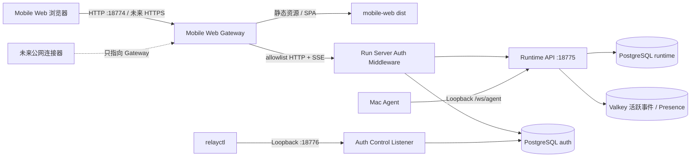
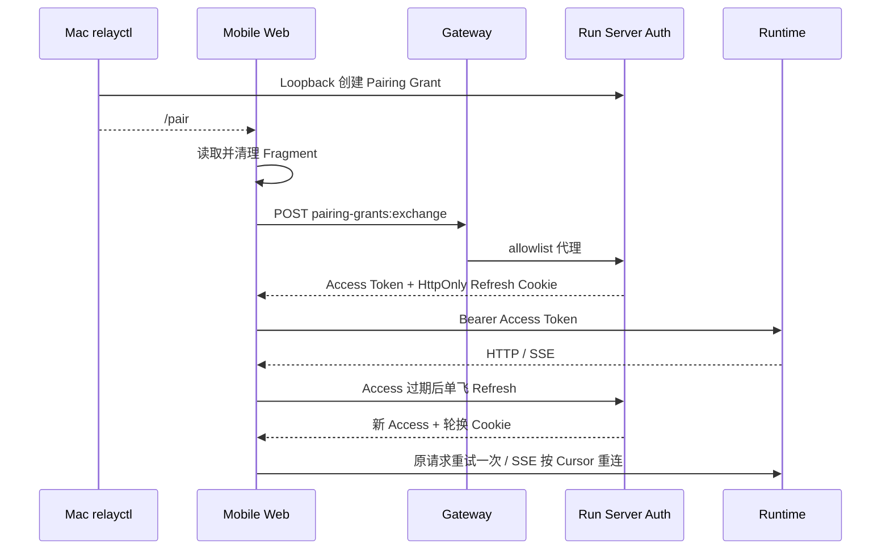

# Mobile Web Gateway 与 Runtime 鉴权架构

> [!success] 已实现基线
> Gateway、Runtime Auth、配对 CLI、Refresh Rotation、前端自动刷新和局域网入口已实现。稳定公网入口仍属于后续架构范围。

## 1. 当前拓扑



| 边界 | 地址 | 可见性 | 权威职责 |
| --- | --- | --- | --- |
| Mobile Web Gateway | `0.0.0.0:18774` | 局域网；未来公网连接器上游 | 单一 Origin、静态资源、精确路由 allowlist、SSE 透传、安全头 |
| Run Server `mobileweb` | `127.0.0.1:18775` | 仅本机 | 最终认证、Scope、Runtime 资源权限与业务状态 |
| Auth Control | `127.0.0.1:18776` | 仅本机 | 创建一次性配对授权、列出与撤销客户端 |
| Vite `4173` | Codex 本机调试 | Loopback 自动鉴权 | 前端热更新；通过 Vite 本机端点创建标准 Pairing Grant，不是部署或公网入口 |
| Vite `4174` | 人工测试 | 明确调试 | 保持正常配对流程，不提供自动鉴权 |

Gateway 归属 `mobile-web` 仓库，Auth 归属 `relay-server`。两者通过版本化 HTTP 契约协作，不共享兄弟仓库源码。Admin Web、Diagnostics、SLS 和 CoreDevice 仍属于 `admin-platform`。

### 1.1 `devrun crweb` 开发栈监督边界

`devrun crweb` 使用 `runtime-distribution` 的新增 `dev-supervisor` 命令，构建并托管当前工作树的 Relay、Mac Agent 和 Gateway。外层只注册独立的 `com.codexremote.runtime.dev.sse` 或 `.poll` LaunchAgent，不接管发布版 `com.codex-remote.runtime`，也不复用发布版状态目录。SSE 使用 `18874/18875/18876`，Poll 使用 `18884/18885/18886`；两种完整栈互斥。Vite `test/codex/poll` 仍是前端快速开发入口，不属于完整栈子进程。

### 1.2 独立性与依赖方向

| 模块 | 已具备的独立性 | 有意保留的集成关系 | 禁止依赖 |
| --- | --- | --- | --- |
| Mobile Web Gateway | 独立 Go module、独立二进制、独立端口、独立健康检查，可只依赖静态 `dist` 和配置的 HTTP 上游运行 | 与 Mobile Web 同仓、同一用户入口版本发布；`deploy.sh` 只在部署期编排兄弟仓库进程 | 不导入 Relay/Auth 源码，不连接 PostgreSQL、Redis、Mac Agent WSS 或 Admin API |
| Runtime Auth | `internal/auth` 独立包、`Store` 接口、独立 `auth` Schema/迁移；公开 API、Control Handler 和中间件由 `auth.Module` 封装 | 当前与 Run Server 同一 Relay 二进制、同一 PostgreSQL 实例；Auth Control 是同进程的独立 Loopback Listener，不是独立微服务 | 不解析 Runtime 路由、不访问 Runtime/Redis、不承担 Admin 用户/RBAC 或 Gateway 路由 |
| Server 组装层 | 只通过最小 `RuntimeAuthModule` 接口挂载 Auth，并提供“请求需要哪个 Scope”的 Runtime 路由策略 | 负责把 Runtime、Auth Public API 和 Control Listener 组装进同一进程 | Runtime Handler 不自行解析 Token；Gateway 不被视为已认证来源 |

这里的“独立”指代码、数据 Schema、监听边界和可替换接口独立，不表示新建第六个仓库，也不表示 Auth 已拆成可单独部署的网络服务。若未来拆分 Auth，只替换 `RuntimeAuthModule` 适配与存储部署，不改变浏览器 `/v1/auth/*` 或 Runtime Bearer 契约。

## 2. Gateway 合同

Gateway 只代理下列已审计操作：

| 方法与路径 | 说明 |
| --- | --- |
| `POST /v1/auth/pairing-grants:exchange` | 一次性配对码兑换 |
| `POST /v1/auth/tokens:refresh` | Refresh Cookie 轮换 |
| `POST /v1/auth/sessions/current:revoke` | 当前设备退出 |
| `GET /v1/auth/me` | 当前 Principal |
| 已登记的 `/v1/runtime/*` 方法与路径 | Project、Session、Run、Bootstrap、Source、Session SSE、Run SSE |
| `GET /gateway/healthz` | 仅表示 Gateway 进程可用，并返回 `contract_version: run-server-v1` |
| `GET/HEAD` 静态资源与 SPA 路由 | `dist` 或显式 Vite 开发上游 |

永不代理 `/v1/auth-control/*`、`/ws/agent`、`/ws/app`、`/status`、Run Server `/healthz`、Debug/Profiling 路径、未知 `/v1/*` 或客户端指定的任意上游。

Gateway 删除客户端伪造的 `Forwarded`、`X-Forwarded-*`、`X-Real-IP`、`True-Client-IP` 和 `CF-*` 身份头，保留 `Authorization`、`Last-Event-ID`、`Idempotency-Key`、`X-Request-Id`、`Set-Cookie` 和流式响应。`httputil.ReverseProxy` 以立即 Flush 模式传递 SSE，不缓冲或压缩事件流。

Gateway 暴露面由 `mobile-web/gateway/contract_v1.go` 单独维护，契约标识为 `run-server-v1`；上游机器事实源仍是 `relay-server/apifox/openapi.json`。新增 Run Server 接口不会自动穿透 Gateway，必须显式更新 allowlist、契约测试和 `mobile-web/docs/run-server-v1-compatibility.md`。这是一处有意的安全耦合，不是源码耦合。

### 2.1 Codex 本机调试自动鉴权

`./start.sh codex` 会为 Vite 注入仅开发期可见的自动鉴权标记。浏览器在 `127.0.0.1:4173` 没有 Refresh Session 时，请求 Vite 的 `/__codexremote__/auth/auto-pair`；Vite 固定调用 `127.0.0.1:18776` 创建一次性 Pairing Grant，浏览器随后仍通过公开 Exchange 接口取得普通 Access/Refresh Token。

该端点要求 Loopback Socket、Loopback Host、可选 Origin 也必须为 Loopback，并要求 `X-CodexRemote-Debug: 1`。它只在 `codex` 模式启用，不属于 Gateway `run-server-v1`、不进入生产构建，也不对局域网 IP、`4174` 或 `18774` 生效。自动化只是省略人工打开配对链接，不绕过 Token、Scope、Refresh Rotation 或撤销逻辑。

## 3. Runtime Auth 模型

### 3.1 配对

推荐使用独立二维码工具；它自动检测 Mac 的私有局域网 IPv4，只通过 Loopback Auth Control 创建授权，并在终端显示二维码：

```bash
cd relay-server
./bin/pairqr
devrun crpair
```

`devrun crpair` 是推荐的全局入口，完整身份为 `devrun codexremote mobileweb-pairing qr`；由于注册端口使用真实 Loopback Auth Control `18776`，也可运行 `devrun 18776`。devrun 只分发到项目内 `pairqr.sh`，二维码仍直接输出到当前终端，不启动新服务，也不重启 Gateway、Run Server 或 Mac Agent。

地址自动检测不符合实际网络时可显式指定，并可选保存权限为 `0600` 的 PNG：

```bash
devrun crpair --origin http://<mac-lan-ip>:18774 --name "My iPhone"
devrun crpair --output .run/mobileweb/pairing.png
```

不需要二维码时仍可生成纯文本链接：

```bash
./bin/relayctl pair \
  --control-url http://127.0.0.1:18776 \
  --origin http://<mac-lan-ip>:18774 \
  --name "My iPhone"
```

输出为 `http://<mac-lan-ip>:18774/pair#code=<opaque-code>`。配对码默认 10 分钟过期、只能使用一次，服务端只保存 SHA-256 哈希。前端从 Fragment 读取后立即清理地址栏，再通过同源接口兑换。

### 3.2 Token

| 凭证 | 默认 TTL | 客户端位置 | 服务端存储 |
| --- | --- | --- | --- |
| Access Token | 15 分钟 | JavaScript 内存 | Token ID、Secret 哈希、Scope、到期时间 |
| Refresh Token | 30 天 | `HttpOnly; SameSite=Strict` Cookie | Session ID、当前 Secret 哈希、已用哈希历史、到期/撤销状态 |

Token 是高熵 Opaque 值，不是 JWT。数据库位于独立 `auth` Schema，包含 `clients`、`pairing_grants`、`refresh_sessions`、`refresh_token_history` 和 `access_tokens`。Auth 首版不使用 Redis。

Refresh Rotation 在 PostgreSQL 事务中完成。当前 Refresh Token 使用后进入历史表并签发新 Token；任何历史 Refresh Token 再次出现都视为重放，整个 Refresh Session 及其 Access Token 立即撤销。正常轮换不提前撤销仍在 TTL 内的 Access Token，以支持多标签页；前端使用进程内单飞和 Web Locks 串行刷新。

### 3.3 Scope 与强制边界

| Scope | 允许 |
| --- | --- |
| `runtime:read` | Runtime `GET/HEAD` 与 SSE |
| `runtime:write` | 创建 Session/Run、取消、Bootstrap |
| `source:read` | 受控源码读取 |

所有 `/v1/runtime/*` 都由统一中间件默认拒绝匿名请求。`internal/server` 决定每个 Runtime 请求所需 Scope，`internal/auth` 只认证 Token、校验调用方要求的 Scope 并注入 `Principal`；Runtime Handler 只消费经过验证的 `Principal`。Source 不再使用独立临时 Token。Gateway 不是认证边界，即使绕过 Gateway，Run Server 仍要求有效 Access Token 和 Scope。

## 4. 浏览器流程



配对和刷新 POST 必须携带 `X-CodexRemote-Request: 1`；配合 `SameSite=Strict` Cookie 防止跨站 Cookie 请求。局域网使用 HTTP 时 `AUTH_COOKIE_SECURE=false`；未来公网必须使用 HTTPS 并设置 `AUTH_COOKIE_SECURE=true`。

## 5. 本地与未来公网兼容性

| 维度 | 局域网当前实现 | 未来稳定公网 |
| --- | --- | --- |
| 浏览器 URL | `http://<lan-ip>:18774`；开发 Poll 为 `:18884` | `https://<stable-domain>` |
| 前端 API | 同源 `/v1/auth/*`、`/v1/runtime/*` | 不变 |
| Gateway 上游 | Loopback Run Server | 不变 |
| Access/Refresh | Opaque + Rotation | 不变 |
| Cookie | `HttpOnly; SameSite=Strict` | 增加 `Secure` |
| TLS / Tunnel | 无 | 受控公网连接器只指向 Gateway |

Origin 变化会隔离 Cookie 和 IndexedDB，因此从局域网迁移到稳定公网域名时需要重新配对。这是浏览器安全边界，不是协议不兼容。

公网开放前必须完成稳定 Origin、TLS、`AUTH_COOKIE_SECURE=true`、公网速率限制、连接/Body 上限、日志脱敏、恢复演练和外部安全检查。

## 6. 运行与运维

```bash
devrun codexremote mobile-web-gateway gateway
# 或
devrun 18774
```

完整栈由外部执行 `devrun crweb`。不要从当前 Mac Agent 承载的 Turn 内同步替换 Relay、Gateway 或 Agent。

设备管理：

```bash
./bin/relayctl auth-clients
./bin/relayctl revoke-client --client <client_id>
```

关键配置：`AUTH_ENABLED`、`AUTH_CONTROL_ADDR`、`AUTH_ACCESS_TTL`、`AUTH_REFRESH_TTL`、`AUTH_PAIRING_TTL`、`AUTH_REFRESH_COOKIE_NAME`、`AUTH_COOKIE_SECURE`。

## 7. 已验证与未覆盖

已自动验证：Auth 单元测试、配对一次性/过期、Scope、Access 校验、Refresh Rotation、重放撤销、客户端撤销、Gateway 路由拒绝/Header 清理/SPA/SSE 代理、前端内存 Token/单飞刷新/401 重试、Codex Loopback 自动配对边界，以及真实 PostgreSQL/Valkey 临时端口端到端链路。

2026-08-23 已在 iPhone Safari 完成单标签扫码、刷新恢复、真实 Run/SSE、退出和控制面撤销。双标签并发刷新会触发 `refresh_replay` 撤销，Cursor 过期恢复、中文 marked-text、VoiceOver、Reduce Motion 与长时间弱网仍需后续复验。详细证据见 `mobile-web/docs/iphone-safari-acceptance.md`。
