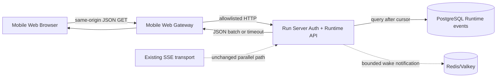

# Runtime JSON 轮询传输架构

> [!note] 本地实现状态
> JSON 轮询接口、Gateway allowlist 和 Mobile Web Transport Adapter 已实现并通过仓库自动化测试。真机压力、长期恢复、限流和公网边缘入口仍未验收，因此不代表生产可用。

## 1. 目标与范围

目标是在不改变 Runtime 业务事件和持久化模型的情况下，增加一种只依赖完整 JSON HTTP 响应的事件传输。它服务于不能可靠承载 SSE 的 HTTP 边缘环境，也可作为移动浏览器的降级通道。

本文覆盖：

- Session/Run 增量事件的 JSON 长轮询；
- PostgreSQL 权威事件读取与 Redis/Valkey 唤醒；
- Gateway 同源代理边界；
- 前端 Transport Adapter、游标、重试和终态；
- 资源、重复、超时和断线恢复控制。

本文不覆盖：

- Cloudflare、域名、Tunnel 或公网发布选择；
- 新的业务事件类型；
- Redis 替代 PostgreSQL 成为事实源；
- iPhone 原生客户端迁移；
- Admin/Diagnostics 数据流。

公网边缘、域名和 Tunnel 选择不属于本文范围；本文继续作为边缘无关的 Poll 传输事实源。

## 2. 目标拓扑



Gateway 仍是浏览器唯一入口。浏览器不访问 PostgreSQL、Redis/Valkey、Run Server loopback 端口或 Mac Agent WSS。轮询接口与现有 SSE 接口共享认证、Scope、Envelope、Gateway 路由审计和同源 Cookie 边界。

## 3. 一次轮询的时序

```text
Client                         Run Server                         PostgreSQL / Redis
  | GET events:poll(after=N)       |                                  |
  |------------------------------->|                                  |
  |                                | query events > N                 |
  |                                |--------------------------------->|
  |                                | no durable event                 |
  |                                |<---------------------------------|
  |                                | wait for bounded notification     |
  |                                |<---------------- Redis wake -------|
  |                                | query PostgreSQL again             |
  |                                |--------------------------------->|
  |<-- JSON batch / empty timeout --|                                  |
  | next request uses next_cursor   |                                  |
```

事件到达时必须先完成 PostgreSQL 的幂等持久化，再发出 Run/Session 通知。若通知早于持久化、通知丢失或 Redis 暂时不可用，客户端仍可以在下一个请求中从 PostgreSQL 的 sequence 恢复。

## 4. 事件与游标

- Session 轮询使用 `session_sequence`。
- Run 轮询使用 `agent_sequence`。
- sequence 单调递增，响应中的 `next_cursor` 是本批最后一个已返回事件。
- 事件必须按 sequence 升序返回，不能只返回最新一条而跳过中间事件。
- 客户端按 `(resource_id, sequence)` 幂等应用；网络重试可以重新返回已消费批次。
- 终态事件也必须进入同一序列，并与 `terminal/status` 一起返回。
- 现有 SSE 的 `id`、事件类型和事件数据语义保持不变；JSON 轮询只是把同样的事件批量放在 JSON Envelope 中。

## 5. 等待与资源边界

建议初始上限：

| 参数 | 目标值 | 约束 |
| --- | ---: | --- |
| `wait_ms` | 15000 | 服务端最大 15000，客户端超时至少 20000 |
| `limit` | 100 | 单批事件上限；超出时 `has_more=true` |
| 空响应重连 | 立即但带抖动 | 100-500 ms jitter，避免同步惊群 |
| 失败退避 | 750 ms 起 | 指数退避并设置上限；429 使用 `Retry-After` |
| 同一资源轮询 | 1 个 | 前端 Adapter 去重，服务端可做二次保护 |

长轮询不是无限连接。服务端必须监听 HTTP request context，浏览器取消、页面切换或移动系统暂停时立即释放等待。响应丢失时客户端可以重试原 cursor，不依赖服务器保存客户端连接状态。

## 6. 数据库与实时层职责

PostgreSQL：

- 保存 Runtime 事件和 Run/Session 状态；
- 根据 `resource_id + sequence > after` 有序读取；
- 决定事件是否已经 durable；
- 在游标恢复、Redis 故障和多实例场景下提供最终一致的重建来源。

Redis/Valkey：

- 在 durable 写入后唤醒等待的轮询请求；
- 提供低延迟通知和已有实时流能力；
- 不直接决定客户端可以推进的游标；
- 通知丢失不构成数据丢失，超时重连必须可恢复。

当前代码只有 Session 通知。实现 Run 轮询时需要新增 Run 级通知能力，且通知必须发生在 `AppendAgentEvent` 成功之后。具体使用 Pub/Sub、Stream wake 或同等机制由 `relay-server` 实现阶段决定，但必须满足上述时序。

## 7. 前端传输适配

`App.tsx` 不直接拼接 `events:poll` URL，也不判断 Cloudflare 或其他边缘名称。`RuntimeClient` 提供面向事件的 Adapter：

```text
watchSession(sessionId, after, signal) -> AsyncGenerator<RuntimeEvent>
watchRun(runId, after, signal)       -> AsyncGenerator<RuntimeEvent>
```

Adapter 内部选择：

- `SseTransport`：保留当前 SSE 解码、heartbeat、Last-Event-ID 和断线恢复；
- `JsonPollTransport`：调用新接口、按批处理事件、推进 cursor、处理 timeout 和退避。

两种传输必须输出同样的 `RuntimeEvent`。UI 只关心 `assistant.delta`、工具事件和终态，不关心响应来自 SSE 还是 JSON。

## 8. 故障与恢复

| 故障 | 处理 |
| --- | --- |
| 请求响应丢失 | 用旧 cursor 重试；允许重复批次，客户端幂等应用 |
| Redis/Valkey 不可用 | 轮询请求以短间隔/超时回到 PostgreSQL；实时性下降但不丢 durable 事件 |
| PostgreSQL 不可用 | 返回结构化可重试错误；不从 Redis 冒充权威快照 |
| cursor 未来扩展为过期 | 返回 `410 CURSOR_EXPIRED`，客户端先加载 Session/Run 快照再从新 cursor 继续 |
| 前端切换 Session | Abort 当前 Session/Run 请求，清理唯一控制器，再创建新循环 |
| Run 进入终态 | 应用终态事件，确认 `terminal=true` 后释放 Run 轮询 |
| Gateway/边缘主动断开 | 按 cursor 重连；不把一次连接关闭解释为 Run 取消 |

## 9. 安全边界

- 新接口沿用 `runtime:read` Scope、Bearer Access Token、同源 Refresh Cookie 和 Gateway allowlist。
- `after`、`wait_ms`、`limit`、资源 ID 必须严格解析并限制范围。
- 错误响应不得暴露 SQL、Redis key、内部路径或完整事件正文之外的敏感数据。
- 轮询日志只能记录 route、resource hash、cursor、batch size、latency、outcome，不记录 Token、Prompt 或完整响应。
- 任何外部边缘身份 Header 都不能替代 Run Server Runtime Auth。

## 10. 实施顺序

1. 冻结 [[Run Server JSON 轮询接口规范]] 和事件 Fixtures。
2. 在 `relay-server` 实现持久事件读取、bounded wait、Run/Session durable notification 和测试。
3. 在 `mobile-web` 实现 `JsonPollTransport`、模式配置、超时/重试/幂等测试。
4. 更新 Gateway allowlist、OpenAPI 和兼容记录，并进行局域网 HTTP 验收。
5. 在 SSE 与 JSON 轮询都通过验收后，单独评估任何公网/边缘入口。
