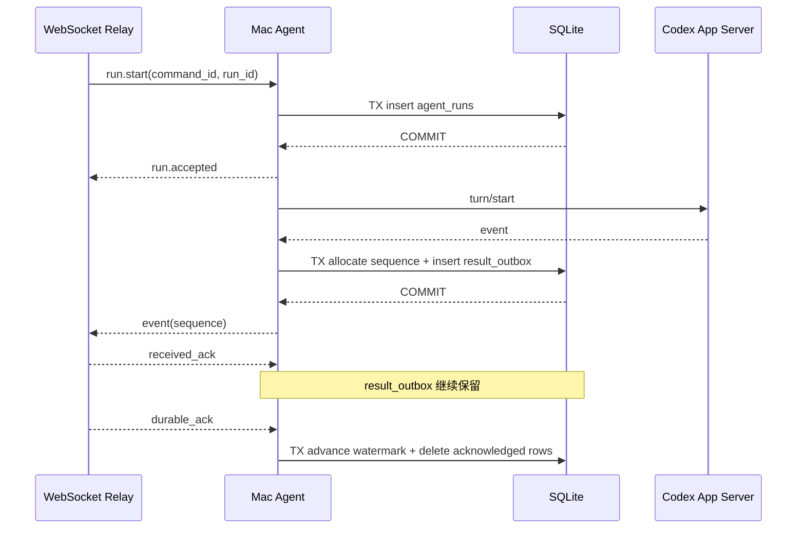

# Runtime SQLite 与 Valkey 数据结构规范

> [!success] SQLite 与 Valkey v1 已实现
> Mac Agent 已落地 4 张 SQLite 表和 WAL 模式；Run Server 已落地 1 个 Result Stream、1 个 Session Pub/Sub 通知和 1 个 Agent Presence Key。Homebrew Runtime 固定内置 Valkey 9.1.1；本地开发仍可连接兼容的 Redis 实例。未增加 Consumer Group、结果缓存或历史镜像。

## 1. 最小职责

| 层 | 只负责 |
| --- | --- |
| Agent SQLite | Run 命令去重、重启检查点、未 durable 结果重放、Bootstrap 续传 |
| Valkey Runtime | 活跃 Run 的低延迟事件、Agent 在线路由、Session SSE 唤醒 |
| PostgreSQL Runtime | 已接受命令、持久事件、最终结果、Session 发现和 Bootstrap 权威状态 |

Valkey 不是数据库权威层。客户端只能经 Run Server HTTPS/SSE 读取，不能直连 Valkey 或 SQLite。本文保留 Redis Stream、Pub/Sub 和 Key 等协议术语，因为 Valkey 使用兼容的数据结构与客户端协议。

## 2. SQLite 运行约定

- 数据库由 `mac-agent` 单进程写入，位于应用支持目录，不放入仓库。
- 启用 WAL、`foreign_keys=ON` 和明确的 `busy_timeout`；具体值在阶段 0 压测冻结。
- Schema 变化使用单调 migration，禁止启动时静默删库重建。
- 不保存 Relay Token、设备私钥、任意命令或项目绝对路径快照。
- 磁盘达到软上限时停止接受新 Run；不得删除未收到 `durable_ack` 的结果。

## 3. SQLite 表清单

| 表 | 唯一职责 |
| --- | --- |
| `schema_migrations` | 本地 Schema 版本 |
| `agent_runs` | `run.start` 去重、执行状态和结果水位 |
| `result_outbox` | 尚未收到 PostgreSQL durable ACK 的结果 |
| `bootstrap_syncs` | `bootstrap.start` 去重及当前续传水位 |

不建立通用 `command_inbox`：当前命令只有 `run.start`、`run.cancel` 和 `bootstrap.start`，分别由 `agent_runs` 与 `bootstrap_syncs` 直接持久化。只有未来出现无法归属于这两种聚合的新命令，才重新评审是否需要 Inbox。

## 4. `schema_migrations`

| 字段 | 类型 | 约束 | 说明 |
| --- | --- | --- | --- |
| `version` | `INTEGER` | 主键 | 单调 migration 版本 |
| `name` | `TEXT` | 非空 | migration 名称 |
| `checksum` | `TEXT` | 非空 | 已应用脚本校验值 |
| `applied_at` | `TEXT` | 非空 | RFC 3339 UTC |

同版本 checksum 不同必须拒绝启动并输出恢复动作。

## 5. `agent_runs`

接收 `run.start` 时先写本表再 ACK；`run.cancel` 只把取消意图更新到同一行。

| 字段 | 类型 | 约束 | 说明 |
| --- | --- | --- | --- |
| `run_id` | `TEXT` | 主键 | Run Server ID |
| `start_command_id` | `TEXT` | 唯一、非空 | `run.start` Outbox 命令 ID |
| `start_payload_json` | `TEXT` | 非空 | 恢复执行所需的规范命令 Payload |
| `status` | `TEXT` | 非空 | Agent 本地执行状态 |
| `cancel_requested` | `INTEGER` | `0`、CHECK 0/1 | 是否已经收到取消意图 |
| `codex_thread_id` | `TEXT` | 可空 | Codex 创建或恢复后回填 |
| `codex_turn_id` | `TEXT` | 可空 | Codex 启动后回填 |
| `next_agent_sequence` | `INTEGER` | `1` | 下一事件序号 |
| `durable_acked_sequence` | `INTEGER` | `0` | PostgreSQL 已连续提交水位 |
| `final_sequence` | `INTEGER` | 可空 | 本地终态事件序号 |
| `created_at` | `TEXT` | 非空 | 本地首次提交时间 |
| `updated_at` | `TEXT` | 非空 | 最近本地提交时间 |

约束：

- `0 <= durable_acked_sequence < next_agent_sequence`。
- `final_sequence` 为空或满足 `0 < final_sequence < next_agent_sequence`。
- 同一 `run_id` 或 `start_command_id` 重复到达返回已有状态，不再次调用 Codex。
- 同一 ID 但命令 Payload 不同视为协议冲突；比较规范 JSON 即可，不额外保存 hash。
- `run.cancel` 重复到达只返回 `cancel_requested=1`，不需要保存每次取消命令。

## 6. `result_outbox`

| 字段 | 类型 | 约束 | 说明 |
| --- | --- | --- | --- |
| `run_id` | `TEXT` | 复合主键、外键 | 所属 Run |
| `agent_sequence` | `INTEGER` | 复合主键 | Run 内连续序号 |
| `event_type` | `TEXT` | 非空 | 版本化 allowlist |
| `schema_version` | `INTEGER` | `1` | Payload Schema 版本 |
| `payload_json` | `TEXT` | 非空 | 规范 JSON |
| `occurred_at` | `TEXT` | 非空 | Agent 观测时间 |
| `created_at` | `TEXT` | 非空 | 本地提交时间 |

规则：

- 分配 `agent_sequence`、插入本表和递增 `next_agent_sequence` 必须在同一 SQLite 事务。
- 先提交本表，再向 Relay 发送。
- Relay 写入 Redis 后返回的 `received_ack` 不删除记录，也不需要持久一个独立水位。
- PostgreSQL 提交后返回 `durable_ack`；Agent 在同一事务推进 `agent_runs.durable_acked_sequence` 并删除已确认记录。
- 重复序号 Payload 不同视为协议错误；读取既有行比较即可，不额外保存 `event_id` 或 `payload_hash`。

## 7. `bootstrap_syncs`

| 字段 | 类型 | 约束 | 说明 |
| --- | --- | --- | --- |
| `sync_id` | `TEXT` | 主键 | 服务端 Sync Job |
| `command_id` | `TEXT` | 唯一、非空 | `bootstrap.start` 命令 ID |
| `snapshot_id` | `TEXT` | 非空 | 接收命令时生成的快照代次 |
| `status` | `TEXT` | 非空 | `running/completed/failed` |
| `next_cursor` | `TEXT` | 可空 | Codex 列表续传游标 |
| `last_durable_batch_no` | `INTEGER` | `-1` | 服务端已提交批次 |
| `last_batch_checksum` | `TEXT` | 可空 | 最近 durable 批次重传校验 |
| `updated_at` | `TEXT` | 非空 | 最近本地提交时间 |

每次只允许一个在途批次，下一批次号始终为 `last_durable_batch_no + 1`。服务端 durable ACK 后，才推进批次水位和游标；因此不需要单独的 `next_batch_no` 或本地批次历史表。

## 8. SQLite 时序

## 9. Redis 结构

首期只定义 3 类 Redis 结构。使用同一高可用 Redis 服务，通过 ACL、Key 前缀和连接池隔离；不用 Redis DB 编号表达职责边界。

| Key/Channel | 类型 | 用途 | 丢失后的恢复 |
| --- | --- | --- | --- |
| `runtime:result:run:{run_id}` | Stream | 活跃 Run 的实时结果 | PostgreSQL 水位 + Agent SQLite 重放 |
| `runtime:presence:agent` | String/JSON | 当前唯一 Agent 的 Relay 实例、连接 generation 和最近心跳 | Agent 重连后重建 |
| `runtime:notify:session:{session_id}` | Pub/Sub | 唤醒 Session SSE 实例读取 PostgreSQL | 可丢；SSE 重连/补查仍读 PostgreSQL |

不预建服务心跳、Session/Run 缓存、Run Pub/Sub 或 Rate Limit Key。服务监控属于部署可观测性；缓存和限流等出现测量需求后再通过 ADR 引入。

> [!danger] Key 隐私
> Redis Key 不得包含 Prompt、Token、绝对路径、邮箱或其他正文/身份信息，只使用不可反推正文的资源 ID。

## 10. Result Stream 字段

| 字段 | 说明 |
| --- | --- |
| `event_type` | 版本化事件类型 |
| `schema_version` | Payload Schema 版本 |
| `payload` | 规范 JSON |
| `occurred_at` | Agent 观测时间 |

Redis Stream ID 明确使用 `{agent_sequence}-0`，例如 Agent 序号 41 写成 `41-0`。同一事件重发时 `XADD` 不会生成第二条；Relay 读取既有条目并比较规范字段，相同则返回现有 `received_ack`，不同则报告协议冲突。客户端仍只把解析出的 `agent_sequence` 当作业务 Cursor，不暴露通用 Redis ID。

当前 Runtime Event Persister 集成在 Relay Coordinator：先 `XADD` 后返回 `received_ack`，再以 `(run_id, agent_sequence)` 幂等写 PostgreSQL，COMMIT 后返回 `durable_ack`。因此首版不创建 Consumer Group；阶段 7 只有在需要独立多实例 Persister 时才通过新 ADR 引入。

## 11. SSE 读取

- Run SSE：先从 PostgreSQL `run_events` 读取客户端 Cursor 后的持久事件，再用 `XREAD` 读取活跃 Stream 的未持久事件并按 `agent_sequence` 去重。
- Session SSE：从 PostgreSQL `session_events` 按 `session_sequence` 读取；Pub/Sub 只负责唤醒，不承载唯一 Payload。SSE 心跳周期可附带从固定 presence Key 读取的当前在线摘要，无需额外 presence 通知频道。
- Run 完成且 PostgreSQL 已覆盖 `final_sequence` 后，客户端只读 PostgreSQL；Redis Stream 可在宽限期后删除。
- Redis Stream 缺失时，Run Server 返回 PostgreSQL 已持久部分；若 Run 未完成，再按水位要求 Agent 重放，而不是向客户端伪造完成。

## 12. 容量与清理草案

| 数据 | 草案策略 | 阶段 0 待冻结 |
| --- | --- | --- |
| 活跃 Result Stream | 运行中不因普通 TTL 消失；终态 durable 后保留宽限期 | 最大条数、字节和宽限期 |
| Agent presence | 短 TTL，心跳周期小于 TTL | 心跳和离线判定 |
| `result_outbox` | 只按 durable ACK 删除 | Agent 磁盘软硬上限 |
| `agent_runs` | 终态 durable 且 Outbox 清空后延迟清理 | 去重保留窗口 |
| `bootstrap_syncs` | 服务端 Sync Job 终态 durable 后延迟清理 | 保留窗口 |

## 13. 故障规则

| 故障 | 正确行为 |
| --- | --- |
| Redis 清空 | 从 PostgreSQL 水位继续读；未持久部分要求 Agent SQLite 重放 |
| Persister 停止 | Redis 和 Agent Outbox 保留事件，Run 保持 `finalizing` |
| Agent SQLite 锁定或磁盘满 | 停止接受新 Run并报告背压，不绕过本地落盘 |
| Agent SQLite 损坏 | 隔离并只读诊断，展示 PostgreSQL 已持久部分；不静默删库盲目重跑 |
| Pub/Sub 通知丢失 | SSE 心跳或重连后按 Session 序号补读 PostgreSQL |

## 14. 实现验收

- [ ] SQLite migration 只创建本文 4 张表。
- [ ] Redis 只创建本文 3 类结构，Key 由集中构造器生成。
- [ ] Redis 清空、Persister 重启、Agent 重启、磁盘满和乱序 ACK 有自动测试。
- [ ] `received_ack` 与 `durable_ack` 在代码、日志、协议和本文中语义一致。
- [x] 首版只使用上述 3 类 Redis 数据；Stream 仅承载活跃事件，PostgreSQL 是持久权威。
- [ ] Stream `MAXLEN` 和终态清理策略在阶段 7 压测后冻结，当前属于生产硬化待实现项。
