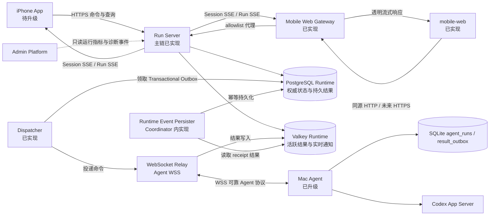
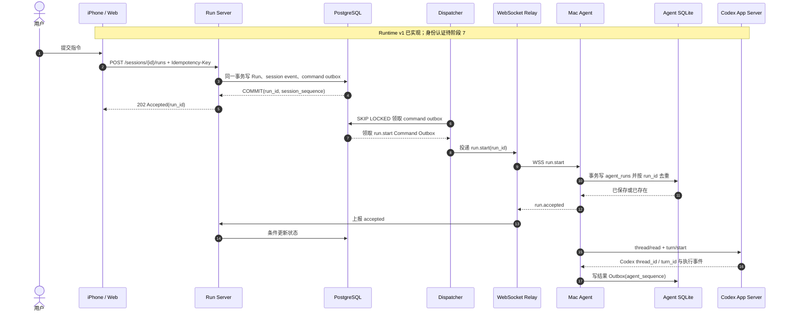
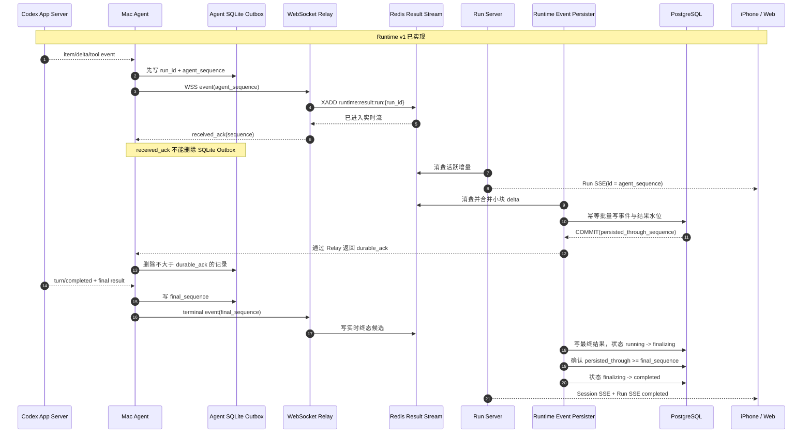
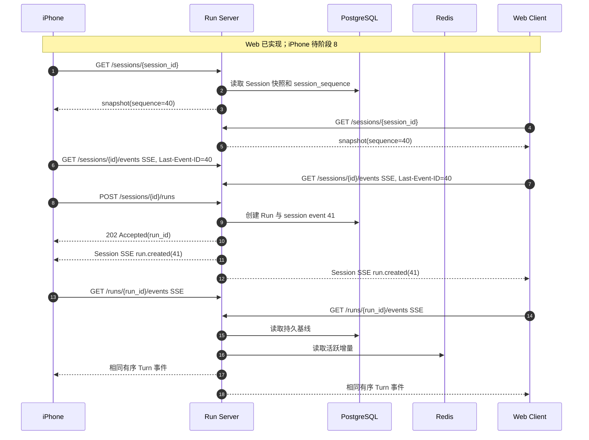
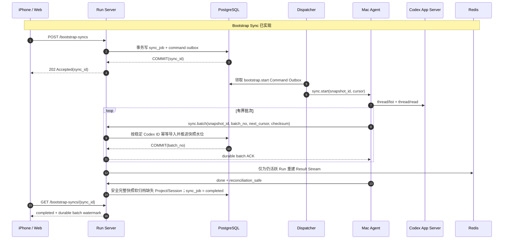
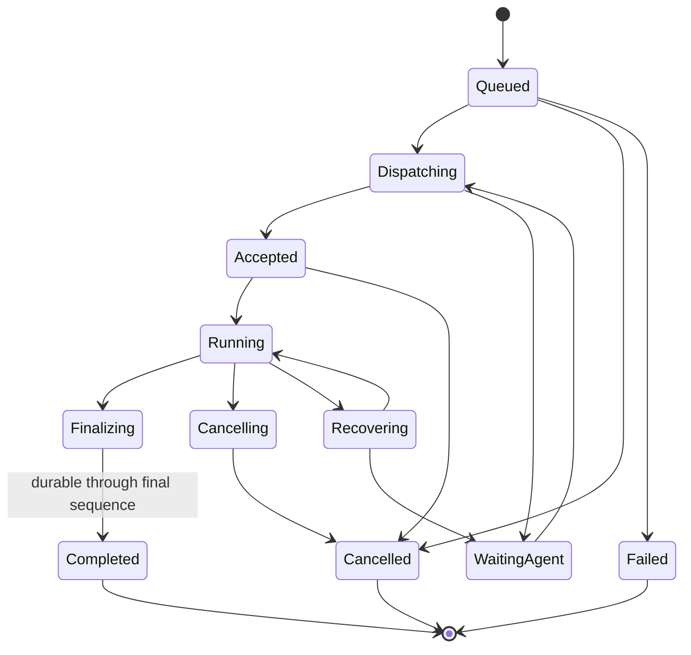

# 可靠多端会话与运行时控制面升级方案

> [!success] Runtime v1 主链已实现
> Run Server、PostgreSQL、Valkey、Agent SQLite、Dispatcher、双 ACK、Bootstrap、Session/Run SSE、Mobile Web Gateway 和 Runtime Auth 已实现，并通过局域网单标签真机闭环。公网 TLS/限流、多实例硬化与 iPhone HTTP/SSE 迁移仍待实现。

> [!important] 文档唯一职责
> 本文回答“最终系统是什么”；[[ADR-007 PostgreSQL 权威运行时与 Redis 实时加速]] 回答“为什么这样取舍”；[[可靠多端运行时分阶段开发计划]] 回答“以什么顺序开发和验证”。旧的远期协议草案不再作为实现依据。

## 1. 最终结论

目标系统采用以下边界：

- `mobile-web` 通过 Gateway 和 Run Server HTTP/SSE 完成主要联调；未来公网在边缘使用 HTTPS，iPhone 最后迁移到同一契约。
- `mobile-web` 的浏览器入口是独立 Mobile Web Gateway：局域网和未来公网都从单一 Origin 消费相同 Runtime/Auth 路径，Gateway 不代替 Run Server 鉴权。
- Mac Agent 与公网 WebSocket Relay 保持一条主动建立的 WSS 长连接。客户端不再连接 Agent，也不通过客户端 WebSocket 订阅结果。
- PostgreSQL 保存 Run 身份、生命周期、命令 Outbox、最终结果和已经确认持久化的事件，是服务端权威事实来源。
- Redis 保存运行中的低延迟结果流、在线状态、通知和可重建热点缓存，不是终态或唯一历史来源。
- Mac Agent 先将 `run.start` 写入本地 `agent_runs`、将结果写入 `result_outbox`；只有收到 PostgreSQL 已提交的 `durable_ack` 后才能删除结果。
- 多个客户端通过同一个 Session 视图发现新 Run，并分别订阅目标 Turn；任何一个客户端离线都不影响其他客户端。
- 初始化由客户端触发异步 Bootstrap Sync，但同步任务由 Run Server 持久化和调度，客户端退出后仍可继续。
- 本阶段不实现周期性 Reconciler。断线恢复依赖协议握手、水位对账和 Agent SQLite 重放。

## 2. 目标与非目标

### 目标

- iPhone 与 Web 同时动态查看同一 Session 和同一 Turn。
- 命令重复提交、重复投递或连接重试时不重复执行。
- Run Server、Redis、Result Persister 或 Relay 重启后，已持久数据不丢失，未持久结果可由 Agent 重放。
- 完成状态绝不早于最终结果持久化。
- Redis 故障只降低实时性，不改变已经持久化的业务事实。
- 首次接入时可将 Mac Agent 已有 Thread/Turn 数据初始化到 PostgreSQL，并只预热必要的 Redis 数据。

### 本阶段非目标

- 不让官方 Codex Desktop 直接订阅 Run Server SSE。
- 不允许客户端直接读取 Redis、PostgreSQL 或 Mac Agent。
- 不实现周期扫描所有异常 Run 的 Reconciler。
- 不把 Runtime 表、Redis 或调度逻辑放入 Admin Platform。
- 不承诺同一工作区内多个写入型 Turn 的任意并发；默认同一执行范围串行。
- 不提前决定 Redis Cluster、Redis Sentinel 或托管 Redis 产品。

## 3. 名称与组件边界

| 组件 | 目标职责 | 实现位置 | 状态 |
| --- | --- | --- | --- |
| Run Server | HTTP/SSE、读取模型、Run 生命周期与 Runtime Auth；公网边缘使用 HTTPS | `relay-server` Runtime/Auth 模块 | 已实现 |
| Mobile Web Gateway | 页面静态资源、单一 Origin、路径 allowlist、Runtime/Auth 代理和 SSE 透传 | `mobile-web` 独立服务 | 已实现 |
| Dispatcher | 领取 PostgreSQL Outbox，向在线 Agent 投递结构化命令 | `relay-server` Runtime Coordinator | 已实现 |
| WebSocket Relay | 维护 Mac Agent WSS、连接路由和背压；Agent 认证阶段 7 实现 | `relay-server` | 主链已实现 |
| Runtime Event Persister | Redis receipt 后幂等写 PostgreSQL并返回 durable ACK | `relay-server` Runtime Coordinator | 集成实现 |
| PostgreSQL Runtime | Session、Run、状态、命令 Outbox、持久结果、同步任务 | `runtime` Schema | 已实现 |
| Valkey Runtime | 活跃结果流、presence 和 Session 通知 | Homebrew 内置 Valkey；开发可用兼容 Redis | 已实现 |
| Mac Agent | 执行 Codex、SQLite Run 检查点/Result Outbox、序号和重放 | `mac-agent` | 已实现 |
| Mobile Web | HTTPS/SSE Runtime 客户端和多标签页验证 | `mobile-web` 独立仓库 | 已实现并验收 |
| iPhone App | 最后复用已验证的 HTTPS、快照和 Session/Run SSE | `iphone-app`，阶段 8 | 待升级 |
| Admin Platform | 用户管理、诊断、行为、审计和运维查询 | `admin-platform` | 不进入执行关键路径 |

> [!note] Run Server 不是新的客户端
> 它是公网运行时服务边界，可以复用 `relay-server` 仓库，但必须与 WebSocket Relay 的连接转发职责、Admin Platform 的管理职责清晰分层。

## 4. 目标拓扑

## 5. 数据权威与读取规则

| 数据 | 权威来源 | Redis 作用 | 客户端读取方式 |
| --- | --- | --- | --- |
| Session、Run 身份和生命周期 | PostgreSQL | 可缓存摘要 | Run Server HTTP/SSE |
| 待投递命令 | PostgreSQL Transactional Outbox | 可唤醒，不保存唯一命令 | 不直接读取 |
| Agent 未持久结果 | Mac Agent SQLite Outbox | Redis Stream 提供低延迟读取 | Run SSE |
| 已持久事件与最终结果 | PostgreSQL | 活跃期可保留副本 | Run Server HTTP/SSE |
| Agent 在线状态 | Redis 短 TTL | 主实时视图 | Session SSE/HTTP |
| 初始化进度与检查点 | PostgreSQL | 可缓存当前进度 | HTTP/Session SSE |

客户端始终只读 Run Server：

- Run 运行中：Run Server 合并 PostgreSQL 基线与 Redis 活跃增量。
- Run 已完成：Run Server 只返回 PostgreSQL 中完整且已持久化的结果。
- Redis 缺失：Run Server 返回 PostgreSQL 已持久部分，并根据 Agent 在线状态标记 `recovering` 或 `waiting_agent`，不能伪装为完整结果。
- Redis 中不得长期保存全部历史。终态保留一个短暂宽限期后删除，只从 PostgreSQL 读取。

## 6. 提交与执行时序

### 标识符规则

- `run_id` 由 Run Server 生成，是客户端提交后立即得到的凭证。
- `codex_thread_id` 和 `codex_turn_id` 由 Agent 调用 Codex 后回填。
- 三者不得复用或混称。客户端用 `run_id` 订阅和查询，界面可在映射完成后展示 Codex 标识。
- 同一用户范围的 `Idempotency-Key` 必须有唯一约束；相同键不同请求摘要返回冲突。

## 7. 实时结果与双确认时序

关键约束：

- 文本 delta 可按 30-100 ms 或 4-16 KiB 合并后写 PostgreSQL，具体值在压测后确定。
- Tool 完成、Item 完成、最终结果和终态必须持久化。
- `completed` 只有在 `persisted_through_sequence >= final_sequence` 时才能成立。
- `(run_id, agent_sequence)` 必须唯一，因此重放是至少一次投递、幂等落库。

## 8. 多客户端发现与订阅时序

两层 SSE 各自解决不同问题：

- Session SSE 是低频会话流，负责让 Web 知道 iPhone 在同一 Session 新建了 Run，并推送状态、完成和 Agent 在线变化。首期不增加全局 Catalog SSE。
- Run SSE 是高频内容流，只传一个 Run 的 item、delta 和 tool 事件。
- HTTP 快照与 `Last-Event-ID` 是首次加载和断线恢复基础；SSE 不是唯一恢复来源。

## 9. Redis 丢失后的恢复边界

> [!warning] 部分已实现
> PostgreSQL 已持久事件可直接补齐 Redis 缺口；未收到 durable ACK 的 Agent SQLite Outbox 会在同一连接内定时重放并在重连时重放。显式 `run.replay(from_sequence)` 和 `recovering/waiting_agent` 状态展示留到阶段 7。

1. Run Server 从 PostgreSQL 读取 `last_durable_agent_sequence`。
2. 如果 Agent 在线，发送 `run.replay(from_sequence)`。
3. Agent 从 SQLite Outbox 重放尚未收到 `durable_ack` 的事件。
4. Relay 重新写入 Redis，Runtime Event Persister 幂等写 PostgreSQL。
5. 客户端继续从 Run Server 读取恢复中的流。

若 Agent 离线，只能返回 PostgreSQL 已持久部分，并显示 `waiting_agent`。这不是数据丢失修复器，而是明确表达当前恢复边界。由于本阶段没有 Reconciler，系统不会依赖后台周期扫描发现所有无人关注的陈旧 Run。

## 10. 客户端触发的初始化

初始化用于把 Mac Agent 已有的 Project、Thread、已完成 Turn 和必要结果导入 Run Server。客户端只触发任务，不能直接搬运或写入服务端数据。

初始化约束：

- 当前单 Agent Runtime 同时只有一个活跃 Bootstrap Sync；多个客户端触发时返回同一个 `sync_id`。
- 客户端断开不取消任务；Agent 离线时 Outbox 保持待投递，恢复后从 durable 水位继续。
- 每批必须包含 `snapshot_id`、`batch_no` 和校验值，服务端提交后才确认。
- Bootstrap 按稳定 Codex ID 幂等导入；冲突时不覆盖同步期间产生的实时 Run/Event。
- PostgreSQL 保存完整持久数据；Redis 只为仍活跃 Run 重建 Stream，不复制已完成历史。
- 只有从 `-1` 水位开始并连续完成的清单才标记 `reconciliation_safe=true`。断连续传会重新读取目录，只做导入并返回 `reconciliation_applied=false`；Mobile Web 随后创建一个全新 Job 重试完整对账。
- 删除对账采用软归档：缺失项目与 Codex 会话不再出现在 Runtime 列表，但历史 Run/Event 不删除；项目重新出现时恢复。活跃 Run 和同步开始后的实时项目刷新优先于旧快照。

## 11. 状态机与并发不变量

必须保持的不变量：

- 一个 `run_id` 在 Agent `agent_runs` 中最多启动一次实际 Turn。
- 生命周期更新使用条件写入和版本号，旧连接不能覆盖新状态。
- 默认同一执行范围只允许一个写入型活跃 Run；并发策略需要单独 ADR 才能放宽。
- Session 事件使用 `session_sequence`；Agent 结果使用每个 Run 单调 `agent_sequence`，不使用时间戳决定顺序。
- Dispatcher、Result Persister 和 SSE 实例都可以重复处理消息，但结果必须幂等。
- Run Server 返回 `202` 前，Run 与命令 Outbox 必须处于同一个已提交事务。

## 12. Valkey 部署边界

Homebrew Runtime 使用内置 Valkey 9.1.1；本地开发可以使用兼容的 Redis 实例。逻辑隔离通过键前缀、ACL 和独立连接池实现，不使用数据库编号表达安全或职责边界：

- `runtime:result:run:*`：活跃 Run Result Streams。
- `runtime:presence:agent`：当前唯一 Agent 的连接实例和 generation 短 TTL 状态。
- `runtime:notify:session:*`：可丢失的 Session SSE 唤醒通知。
- 首期不建立 Session/Run Redis 缓存；快照和列表直接读取 PostgreSQL。只有压测证明存在瓶颈后再通过 ADR 引入缓存。

只有在监控证明结果流、presence 或通知之间存在容量、延迟或故障隔离压力时，才拆分物理 Valkey/Redis 兼容服务。

## 13. 安全与资源限制

- 浏览器用户入口只能是 Mobile Web Gateway；公网连接器不直接指向 Vite、Run Server、Mac Agent WSS 或 Auth Control。
- Gateway 使用固定 allowlist 和有界代理，但 Run Server仍对每个受保护请求独立验证 Access Token、Scope 和资源归属。
- HTTPS/WSS 全链路 TLS；Agent 使用设备身份，客户端使用短期用户身份。
- Run、Session、Agent 和 Bootstrap Sync 的查询都执行用户与设备授权校验。
- SSE 每用户、Session 和 Run 有连接上限；慢消费者断开后按游标恢复，不能拖慢持久化。
- Redis Stream、Agent SQLite Outbox 和 PostgreSQL 事件都必须有容量、保留、告警和降级策略。
- Prompt、Response、Diff 和工具输出是否持久化及保留多久，需要在阶段 0 明确隐私与容量策略。
- Admin Platform 只能通过受控 API 或异步诊断事件观察运行时，不直接写 Runtime PostgreSQL 或 Redis。

## 14. 实施入口

Runtime 主链、Gateway、Runtime Auth 与局域网单标签真机门禁已经完成。下一阶段只处理容量、公网硬化和 iPhone 迁移；发布状态统一见 [[0.2.0 Homebrew 发布候选]]，剩余工程门禁见 [[可靠多端运行时分阶段开发计划]]。

所有存储和接口实现必须同时遵循 [[Runtime PostgreSQL 数据表规范]]、[[Runtime SQLite 与 Valkey 数据结构规范]] 和 [[Run Server HTTPS 与 SSE 接口规范]]。阶段 1-7 以 `mobile-web` 为主要前后端验证端，阶段 8 才迁移 iPhone。

在任一阶段完成前：

- 本文 `implementation_status` 记录 Runtime v1 mobile-web 主链已实现；阶段 7/8 继续按待实现管理。
- 对应阶段证据没有通过人工验收，不得开始下一阶段。
- 当前 MVP 文档继续描述正在运行的行为；目标文档不得反向宣称 MVP 已具备新能力。
