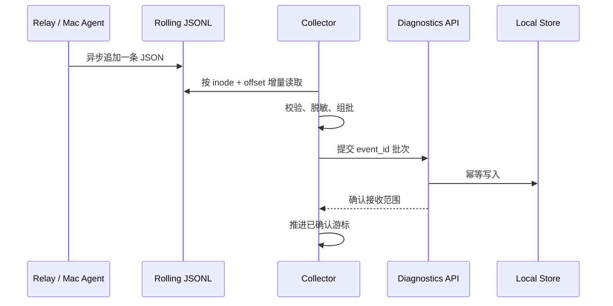

# 日志采集与诊断数据流

## 1. 目标

建立一套可持续维护的结构化诊断链路，同时支持：

- 人在 Admin Web 中快速筛选、关联和建立事故；
- AI 通过稳定 JSON、NDJSON 和 Manifest 读取相同证据；
- 开发阶段使用本机 PostgreSQL 14+，与未来 Admin 用户和权限模型共用迁移；
- 线上平滑接入阿里云 SLS；
- 日志系统失效时不拖慢或压垮业务进程。

## 2. 统一事件信封

技术事件最小字段：

```json
{
  "schema_version": 1,
  "event_id": "evt_...",
  "timestamp": "2026-08-13T10:30:00.123Z",
  "observed_at": "2026-08-13T10:30:01.018Z",
  "level": "error",
  "source": "relay-server",
  "service_instance": "relay-iphone",
  "environment": "development",
  "event": "websocket.disconnected",
  "message": "device connection closed",
  "session_id": "session_...",
  "trace_id": "trace_...",
  "turn_ref": "turnref_...",
  "app_version": "0.1.0",
  "build": "42",
  "fields": {
    "reason": "timeout",
    "memory_bytes": 182345728
  }
}
```

规则：

- `event` 是稳定机器标识，`message` 只做人类摘要。
- `event_id` 在生产端生成；重复提交必须幂等。
- `timestamp` 是事件发生时间，`observed_at` 是 Collector 或摄入服务接收时间。
- 自定义内容只进入允许列表 `fields`，禁止任意嵌套对象无限增长。
- 用户资料、行为、技术事件、审计各自有独立 Schema；本信封只描述共同关联字段。

## 3. Relay 与 Mac Agent



生产端要求：

- 使用 Go `slog` JSON Handler 或等价结构化输出；
- 一行一条 UTF-8 JSON，不输出带颜色的控制字符；
- 异步有界队列，不能由日志 I/O 阻塞 Turn 或 WebSocket；
- 按大小和时间轮转，并设置总容量；
- 队列压力时优先丢弃 `debug/trace`，记录累计丢弃数量；
- 循环、流式 delta、重试和资源压力事件必须采样或聚合。

Collector 要求：

- 使用文件标识、偏移量和头部指纹识别重建及轮转；
- 未获得 API 确认前不推进持久游标；
- 支持重复提交，数据库依赖 `event_id` 去重；
- 设置批次数量、字节、超时、退避和本地积压上限；
- 暴露自身 CPU、内存、采集延迟、积压、重试和丢弃指标；
- 不解析 Prompt、响应、Diff 或源码正文。

线上服务器使用 LoongCollector 直接采集相同 JSONL 到 SLS。本地 Collector 与 LoongCollector 共用字段语义，但各自维护采集游标，不能让两个消费者写同一个目标后产生重复数据。

## 4. iPhone 统一上传逻辑

开发和线上共用：

- Apple Unified Logging；
- 本地有限容量 JSONL；
- 密封日志段和持久上传队列；
- 批量、超时、指数退避、随机抖动；
- 分级采样、容量上限和丢弃计数；
- MetricKit 报告落盘；
- App 启动、前台和网络恢复时补传。

### 触发矩阵

| 触发 | 动作 | 可靠性说明 |
| --- | --- | --- |
| 累积 100-200 条 | 密封并排队 | 阈值可远程配置 |
| 累积 64-256 KiB | 密封并排队 | 防止单批过大 |
| 前台等待 10-30 秒 | 提交当前批次 | 只在存在待传数据时 |
| 网络恢复 | 重试到期批次 | 使用指数退避和抖动 |
| App 启动/进入前台 | 扫描并补传遗留段 | OOM 后的重要恢复点 |
| App 进入后台 | 密封并尝试小批提交 | 不承诺完成全部上传 |
| MetricKit 到达 | 先落盘，再排队 | 报告作为附件或专用事件 |
| 用户提交问题反馈 | 固定事故窗口并提高优先级 | 仍遵守隐私和大小限制 |

数值是目标默认范围，不是当前已实现配置。实现前必须用真机测量 CPU、内存、磁盘、电量和网络开销。

### 开发环境额外能力

开发环境不是第二套日志协议，只增加 CoreDevice 拉取：

```bash
xcrun devicectl device copy from \
  --device <device-id> \
  --domain-type appDataContainer \
  --domain-identifier <bundle-id> \
  --source <diagnostics-directory> \
  --destination <mac-destination>
```

Collector 必须使用 `--json-output` 获取机器可读结果，并只拉取已密封文件。默认由管理员点击触发；设备重新连接时可以提示检查，不应无确认地反复复制完整容器。

### 线上上传

线上使用 SLS iOS SDK 的 Producer、缓存和重试能力，并通过业务服务获取 STS 临时凭据。不能将长期 AccessKey、SLS 管理权限或管理员查询凭据写入 App。

## 5. OOM/Jetsam 证据链

以下触发都不可靠，不能作为最后上传保证：

- `applicationWillTerminate`；
- 内存警告回调；
- 固定时刻的后台任务；
- OOM 发生瞬间发起网络请求。

正确证据链：

```text
强杀前已落盘事件
    + 下次启动补传
    + MetricKit 报告
    + CoreDevice systemCrashLogs
    + 必要时 sysdiagnose
    + Instruments Allocations / Leaks 复现
```

MetricKit 与系统日志用于确认异常类型和时间窗口；它们不能替代 Instruments 的分配回溯。

## 6. CoreDevice 任务

Collector 只支持结构化白名单任务：

| 任务类型 | 默认触发 | 说明 |
| --- | --- | --- |
| App Diagnostics Pull | 人工或设备连接提示后确认 | 拉取密封 JSONL 和 MetricKit 文件 |
| System Crash Logs | 人工确认 | 拉取系统崩溃与 Jetsam 证据 |
| sysdiagnose | 强确认 | 大文件、敏感、耗时，记录完整审计 |
| Device Inventory | 自动低频 | 型号、OS、连接状态；避免永久硬件标识 |

任务记录至少保存申请人、设备引用、类型、参数摘要、开始/结束时间、退出状态、产物哈希和错误码。网页不能传入 Shell、任意路径或未注册的 domain type。

## 7. 存储与保留

| 数据 | 本地默认 | 线上默认方向 |
| --- | --- | --- |
| Debug 技术日志 | PostgreSQL 中 7 天或容量上限 | 短期、采样 |
| Info 技术日志 | 30 天 | 按成本和检索需求 |
| Warning/Error/Fault | 90 天 | 较长保留与告警 |
| 用户行为 | 小样本 | 产品策略决定 |
| MetricKit/Crash | 事故关联前有限保留 | 对象存储 + 生命周期 |
| sysdiagnose | 人工清理或短期 | 最短必要保留 |
| 事故快照 | 人工关闭后按策略 | 长期证据 |
| 管理审计 | 不随普通日志删除 | 合规策略决定 |

这些是建议基线。正式保留期限必须结合隐私、成本和业务要求审批，并在页面显示实际策略。

## 8. 隐私与安全

禁止记录：Prompt、Response、Transcript、Console 正文、Token、Cookie、Authorization、Relay URL、完整路径、设备序列号、永久硬件 ID、原始 Turn ID 和用户输入正文。

允许记录：计数、大小、耗时、公开协议类型、错误 domain/code、脱敏引用、版本、环境和布尔状态。

所有上传前执行 allowlist 编码；服务端脱敏只能作为第二道防线。诊断附件可能包含系统敏感数据，因此访问、下载和导出都必须审计。

## 9. SLS 映射

- `source` 映射日志来源或自定义标签。
- `environment`、`service_instance`、`app_version`、`build` 建立字段索引。
- `level`、`event`、`trace_id`、`session_id`、`user_id`、`device_id` 支持过滤与统计。
- `fields` 中需要查询的稳定字段显式建立类型索引。
- 保留原始 JSON 用于审计时仍必须在生产端完成脱敏。
- Logstore、技术日志、用户行为和管理审计使用不同权限与保留策略。

## 10. 验收要求

- Relay/Mac Agent 日志文件轮转时不漏采，允许幂等重复。
- Admin 暂停后恢复，Collector 从最后确认游标继续。
- Collector 积压达到上限时有明确告警，不无限占用磁盘和内存。
- iPhone 飞行模式、后台、重启和网络恢复后队列可恢复。
- 真机 OOM 后，下次启动可找到强杀前最后密封日志段和 MetricKit 证据。
- CoreDevice 拉取只访问配置的 Bundle ID 和诊断目录。
- SLS 解析相同 JSON Schema，无需修改生产端字段。
- 人类导出与 AI 导出包含同一事件、数据源、时区、截断和脱敏说明。
