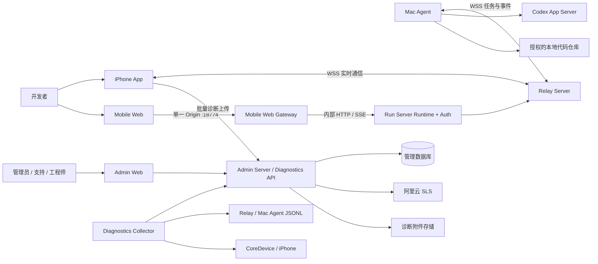
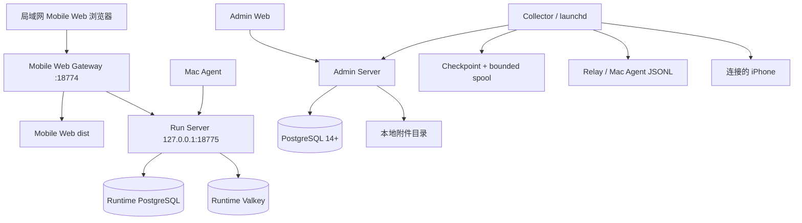
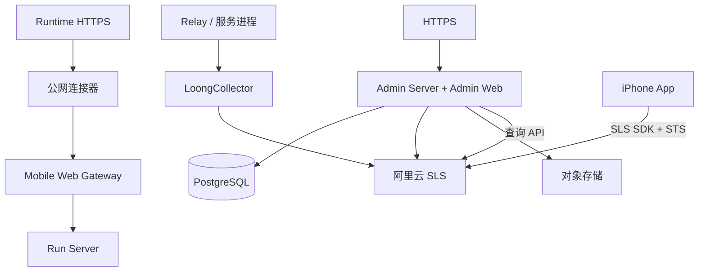

# 系统总体架构

> [!important] 当前实现与目标架构
> 当前可运行基线包括三端 MVP、Mobile Web Gateway、Runtime Auth、Runtime v1 主链和 Admin/Diagnostics 本地闭环。公网入口、SLS 和完整用户管理仍是目标能力，在完成实现与验证前不得标记为已上线。

> [!warning] Runtime 目标已拆分
> iPhone WSS 与 Relay 内存状态只描述原生 iPhone 客户端仍在使用的旧数据通道。Mobile Web 已使用 Run Server、PostgreSQL、Valkey、HTTPS/SSE 和 Bootstrap Sync；局域网单标签真机闭环已经通过，生产硬化仍见 [[可靠多端会话与运行时控制面升级方案]]。

## 1. 系统上下文



当前 iPhone 仍通过旧 App WebSocket；mobile-web 已通过 Gateway 使用 Run Server HTTP/SSE，未来公网边缘升级为 HTTPS。Mobile Web Gateway 是浏览器单一入口，WebSocket Relay 只维护 Mac Agent WSS，Run Server 提供 Runtime 鉴权、HTTP 与 SSE。Admin Platform 仍是独立管理与可观测系统；Runtime 与 Admin 的故障域、扩缩容和发布生命周期相互独立。

## 2. 逻辑平面

### 用户接入面

Mobile Web Gateway 提供页面、静态资源、显式 allowlist 反向代理和 SSE 透传。它不保存用户身份或 Runtime 状态，也不代替 Run Server 鉴权。局域网浏览器访问固定 Gateway 端口，未来公网连接器也只能指向 Gateway；Mac Agent WSS、Auth Control、Redis、PostgreSQL 和 Admin API 永不经过该入口。

### 实时通信面

Relay Server 负责低延迟 WebSocket 通信。它不保存原始日志，不执行 CoreDevice 命令，也不承担后台用户查询。当前 MVP 的 Project、Thread、Turn 协议继续由 Relay 仓库维护。

### 本地执行面

Mac Agent 验证项目边界，通过 Codex App Server 执行 Turn，并将结果返回 Relay。业务执行不能依赖 Admin Platform 在线；诊断采集失败也不能阻断 Turn。

### 管理控制面

Admin Server 与 Admin Web 构成同一个对外管理服务和部署单元，内部按模块化单体划分 `auth`、`users`、`behavior`、`devices`、`diagnostics`、`incidents` 和 `audit`。Diagnostics API 是其中一个模块，不是 Relay API。

### 采集面

Diagnostics Collector 是独立进程。它增量读取 Relay/Mac Agent 的滚动 JSONL，维护可靠采集游标，并在用户确认后通过公开的 CoreDevice 命令拉取 iPhone App Data Container、系统崩溃日志或 sysdiagnose。Collector 不直接写管理数据库，只通过版本化 API 提交数据和任务结果。

### 数据面

- PostgreSQL 从第一阶段开始保存管理员、未来用户、权限、设备、事故、诊断事件与任务、附件索引和管理审计。
- Collector 使用本地原子 checkpoint 和有界 spool 保存已确认游标与待重试批次，不直接连接 PostgreSQL。
- 阿里云 SLS 保存线上技术日志、行为事件、指标和 Trace。
- 对象存储或本地附件目录保存 MetricKit、崩溃文件、sysdiagnose 和诊断导出包。

详见 [[Admin 与可观测平台架构]] 和 [[日志采集与诊断数据流]]。

## 3. iPhone 统一诊断模型

开发环境与线上环境使用同一套日志生产、持久化队列、批量上传、失败重试、采样和 MetricKit 逻辑。开发环境只额外开放 Mac 侧 CoreDevice 拉取能力：

```text
开发环境 = 线上诊断逻辑 + CoreDevice App Data Container 主动拉取
```

App 被系统因内存压力强杀时不保证执行终止回调，也不保证收到内存警告。因此证据链必须组合：强杀前已落盘事件、下次启动补传、MetricKit 报告、系统崩溃日志和必要时的 sysdiagnose。

## 4. 数据所有权

| 数据 | 权威来源 | 存储与说明 |
| --- | --- | --- |
| 用户资料、账号状态 | Admin Platform 业务模块 | PostgreSQL；不能以日志反推用户当前状态 |
| 用户行为事件 | 行为事件 Schema | SLS；用于漏斗、留存和操作时间线 |
| 技术日志 | 各组件结构化日志 | 本地 JSONL + SLS；受采样与保留策略控制 |
| 管理审计 | Admin Audit | PostgreSQL 与不可变审计流；记录敏感查询、导出和操作 |
| 诊断任务与附件索引 | Admin Diagnostics | PostgreSQL；附件正文不进入关系数据库 |
| iPhone 诊断文件 | iPhone 沙盒 / Apple 系统 | 上传或 CoreDevice 拉取后进入附件存储 |
| Relay 在线状态 | Relay 连接注册表 | 瞬时状态；Admin 只保存采样或状态变化事件 |
| Codex 原生 Thread/Turn 历史 | Codex App Server | Mac Agent 读取；不复制为第二套 Codex 历史库 |
| Runtime Session/Run/Prompt/持久事件 | Run Server PostgreSQL `runtime` Schema | Mobile Web HTTP/SSE 的权威业务状态 |
| Runtime 客户端、配对与 Token 哈希 | Run Server PostgreSQL `auth` Schema | 与 Admin 用户域分离；明文 Token 不落库 |
| 本地源码 | Mac 文件系统 | 仅受控短期读取，不进入 PostgreSQL、Admin、SLS 或服务日志 |

## 5. 关联标识

跨组件定位依赖稳定字段，不依赖自由文本搜索：

- `event_id`：事件全局唯一 ID，用于幂等和去重。
- `timestamp`、`observed_at`：事件发生时间和采集时间。
- `source`、`service_instance`、`environment`：来源与部署实例。
- `session_id`、`trace_id`：一次 App 会话和跨服务调用链。
- `turn_ref`：脱敏的 Turn 引用；移动端不得上传原始敏感标识。
- `user_id`、`device_id`：只使用平台分配的可撤销引用，不记录永久硬件标识。
- `schema_version`、`app_version`、`build`：解释不同版本事件。

日志、行为事件和审计事件可以共享关联 ID，但必须使用不同 Schema、权限和保留策略。

## 6. 部署拓扑

### 本地开发



局域网用户只访问 `http://<mac-lan-ip>:18774`，Run Server `mobileweb` profile 监听 Loopback；`4173/4174` 仅保留为明确开发调试入口，其中 `4173` 可在 Loopback 上自动完成标准一次性配对，`4174` 仍要求正常配对。本地 Admin 默认只监听 `127.0.0.1`，连接本机 PostgreSQL。需要接收真机上传时，单独开启局域网摄入地址、短期 Token 和明确的来源限制。

### 线上环境



线上 iPhone 不能内置长期 AccessKey；必须通过受信任服务取得最小权限、短时效的 STS 凭证。

## 7. 安全与隐私边界

| 风险 | 控制 |
| --- | --- |
| 日志泄露 Prompt、Token 或源码 | typed allowlist、字段脱敏、禁止正文与凭据进入日志 |
| 后台越权查看用户 | RBAC、数据域权限、查看与导出审计 |
| 网页执行任意设备命令 | Collector 只接受版本化白名单任务，不接受 Shell 字符串 |
| sysdiagnose 包含敏感系统信息 | 明确确认、访问控制、下载审计、保留期限 |
| 日志导致业务 OOM | 有界异步队列、分级丢弃、批量提交、资源指标 |
| 重复采集或上传 | `event_id` 幂等、采集游标在确认后推进 |
| SLS 或 Admin 不可用影响业务 | 日志链路与业务链路隔离，失败只进入有界重试队列 |
| Gateway 错误暴露内部接口 | 固定路由 allowlist、未知路径本地拒绝、Run Server 二次鉴权、Auth Control 独立监听 |
| Refresh Token 被前端脚本读取 | `Secure + HttpOnly + SameSite=Strict` Cookie、Rotation、Origin/CSRF 校验 |

## 8. 演进原则

- 第一阶段采用模块化单体 Admin Server，避免过早拆分微服务。
- Admin Web 可与 Admin Server 同仓开发并由同一服务交付，但前后端模块保持清晰边界。
- Collector 保持独立进程和最小系统权限。
- 线上海量原始日志不迁入 PostgreSQL；SLS 是长期日志数据面。
- 开发、测试和生产 PostgreSQL 通过同一迁移管理；各环境数据库、角色和凭据必须隔离。
- Admin/Diagnostics 第一阶段不引入 Redis；独立 Runtime 已按 [[ADR-007 PostgreSQL 权威运行时与 Redis 实时加速]] 实现 Redis 实时主链，但容量、清理、故障转移和多实例仍待生产硬化。
- 所有新增用户行为先注册稳定事件 Schema，再进入 SLS 和看板。
- Mobile Web Gateway 保持薄边缘：只交付页面和代理版本化 Runtime/Auth 契约，用户与资源授权始终由 Run Server 强制执行。
- 当前实现状态与目标架构分别记录，未经验证的能力不得写成已交付。
