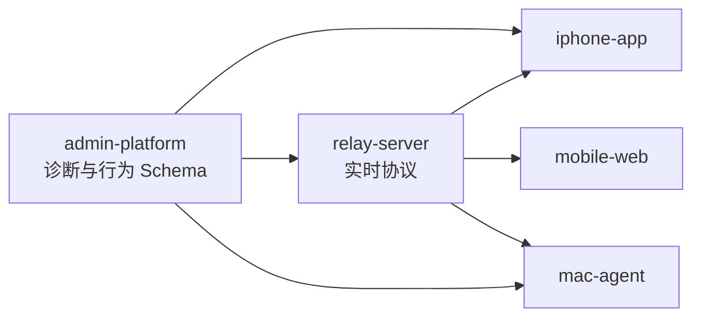

# 项目目录结构

项目采用五个并列、互不嵌套的应用源码仓库，另有 Runtime 分发、第三方 Homebrew Tap 和文档仓库。父目录只是本地工作区，不是 Monorepo。公开的 `homebrew-tap` 是唯一分发仓库，同时承载 Formula 元数据和签名、公证的 Runtime Release 资产。

```text
codexremote/
├── iphone-app/                 # 已存在：iOS App 独立 Git 仓库
├── mobile-web/                 # 已存在：用户侧 Web Client 独立 Git 仓库
├── relay-server/               # 已存在：实时 Relay 独立 Git 仓库
├── mac-agent/                  # 已存在：Mac 执行端独立 Git 仓库
├── admin-platform/             # 已存在：管理与可观测平台独立 Git 仓库
├── runtime-distribution/       # Runtime CLI、组装、Manifest 与安装测试
├── homebrew-tap/               # 第三方 Homebrew Formula 与公开 Release 资产
└── Codex Remote/               # 独立 Obsidian 文档仓库
```

> [!info] 当前状态
> `admin-platform` 已完成本地 PostgreSQL/Collector/Simulator 基础闭环、Incident Snapshot、D 方案 Admin Web 和自动化测试。完整 RBAC/审计、真机 OOM 证据链和 SLS 仍需后续完成。正式 Admin Web 目录见 [[Admin Web 产品与前端架构]]。

> [!info] Mobile Web 当前状态
> `mobile-web` 已实现移动优先界面、真实 Run Server HTTP/SSE、缓存、Gateway 和 Runtime Auth。公网域名、TLS、限流与 Tunnel 尚未实现，不能把局域网 Gateway 视为公网入口已经交付。

## 1. iPhone App

```text
iphone-app/
├── CodexRemote/
│   ├── App/
│   ├── Features/
│   ├── Services/
│   ├── Models/
│   └── Core/                   # Diagnostics、MetricKit、本地日志队列
├── CodexRemoteTests/
├── scripts/                    # 构建、真机与诊断采集
└── docs/
```

只包含 iOS 产品、Relay Client 和 iPhone 诊断生产端。不能执行 CoreDevice 命令，也不能依赖兄弟仓库源码。

## 2. Mobile Web

```text
mobile-web/
├── gateway/                   # 已实现：独立 Go module、用户入口和版本化 allowlist
├── src/
│   ├── components/            # 用户工作区与 Runtime 检查器
│   ├── auth/                  # 已实现：Pairing、Access/Refresh 与多标签页协调
│   └── runtime/               # 真实 HTTP/SSE Adapter、缓存与解码器
├── dist/                      # Vite 构建产物，不手工维护
├── start.sh                   # test/codex/gateway 三种隔离启动模式
├── README.md
└── CHANGELOG.md
```

这是与 iPhone 职责一致的用户客户端及其交付 Gateway，不是 Admin Web。Gateway 只能提供本仓静态产物并代理 Relay 发布的版本化 Runtime/Auth 契约，不得导入兄弟源码。浏览器不得直接访问 Redis、PostgreSQL、Mac Agent WSS 或 Admin API。

## 3. Relay Server

```text
relay-server/
├── cmd/relay/
├── cmd/relayctl/
├── internal/
├── protocol/
├── apifox/
└── README.md
```

当前拥有 MVP Project/Thread/Turn 协议、方向规则和 WebSocket 中枢，也已实现 Run Server HTTP/SSE、Agent WSS、Runtime/Auth PostgreSQL migration、Redis Adapter、OpenAPI 和 Fixtures。`internal/auth` 通过 `RuntimeAuthModule` 接入 Server 组装层；Auth Control 是同一 Relay 进程内的独立 Loopback Listener，不是第六个服务仓库。生产容量、多实例和公网硬化仍待实现。通用用户管理、诊断数据库、SLS 查询和 CoreDevice 不进入此仓库。

## 4. Mac Agent

```text
mac-agent/
├── cmd/agent/
├── internal/
│   ├── relay/
│   ├── codexapp/
│   ├── inventory/
│   ├── runner/
│   └── turn/
├── docs/
└── README.md
```

负责本地项目授权、Codex App Server、Turn 生命周期和结果收集。它生产结构化服务日志，但不负责把日志写入 Admin 数据库或 SLS。

## 5. Admin Platform

```text
admin-platform/
├── web/                       # 目标：React/TypeScript/Vite 源码与测试
├── cmd/
│   ├── admin-server/           # Admin Web + Admin/Diagnostics API
│   ├── collector/              # 文件采集与 CoreDevice 操作
│   └── migrate/                # PostgreSQL 迁移入口
├── internal/
│   ├── collector/
│   ├── device/
│   ├── ingest/
│   ├── model/
│   ├── server/                 # API 与唯一 Web 构建产物的 embed 边界
│   └── store/                  # PostgreSQL 与版本化迁移
├── scripts/
├── docs/
├── dev                         # 本地启动/停止/状态入口
└── README.md
```

`web/` 是当前 React/TypeScript/Vite 源码；旧原生静态页面与无版本 API 已删除。构建产物由 Vite 生成并由 Go embed，不作为第二份手工维护源码。

Admin Server 和 Admin Web 同仓、同一对外服务交付；Collector 同仓但构建为独立进程。模块化单体是初始部署方式，不等于所有模块共享数据库表或权限。

## 6. Runtime 分发

`runtime-distribution` 只消费 Relay、Mac Agent 和 Mobile Web 的版本化构建输入，拥有 `codex-remote` CLI、Supervisor、Manifest、确定性组装和安装测试。`homebrew-tap` 只保存第三方 Formula 元数据。未来官方 Cask 通过 Homebrew 官方仓库提交，同样只引用公开的签名、公证 Runtime 资产。这些分发边界都不得导入兄弟仓库源码或公开私有源码。

## 7. 跨仓协作



- Relay 仓库发布实时通信 Protocol Bundle。
- Mobile Web 与 iPhone 分别维护原生客户端模型，并共同消费版本化 HTTPS/SSE fixtures。
- Admin 仓库发布诊断事件、行为事件、摄入 API 和 Collector 任务 Schema。
- 各生产端在自己的语言中维护类型，通过 Fixtures 做契约测试。
- 不共享 Go/Swift/TypeScript 源码，不从兄弟目录导入包。
- 跨仓变更先确定 Schema 兼容和发布顺序，再分别发布。
- 本地并列目录可用于 E2E，但不能成为单仓 CI 的隐式构建前提。

## 8. 发布边界

| 仓库 | 版本 | 发布物 |
| --- | --- | --- |
| `iphone-app` | App Version + Build | iOS App、dSYM |
| `mobile-web` | SemVer | Web Assets、Mobile Web Gateway、Runtime Client Fixtures |
| `relay-server` | SemVer | Binary、Docker Image、Protocol Bundle |
| `mac-agent` | SemVer | macOS Binary、launchd Package |
| `admin-platform` | SemVer | Admin Server、Web Assets、Collector、Schema Bundle |
| `runtime-distribution` | Runtime SemVer | CLI、Supervisor、Runtime Archive、Manifest |
| `homebrew-tap` | Formula revision | 第三方 Formula 元数据 |

所有仓库独立提交、Tag、CI 和回滚。文档中必须区分“协议兼容”与“要求同一次提交”；前者必须保证，后者不允许成为发布条件。

`admin-platform` 的 Go 服务、Web 源码、Collector、数据库迁移、测试、维护文档与 Changelog 必须一起归属该仓库。根工作区和 `Codex Remote/` 文档库不得承载 Admin 构建产物或代替代码仓库的版本历史。
