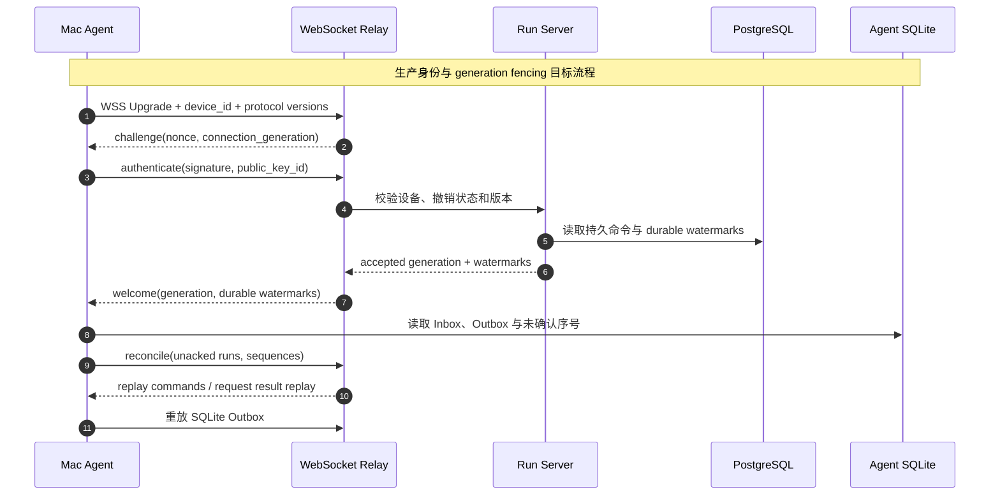
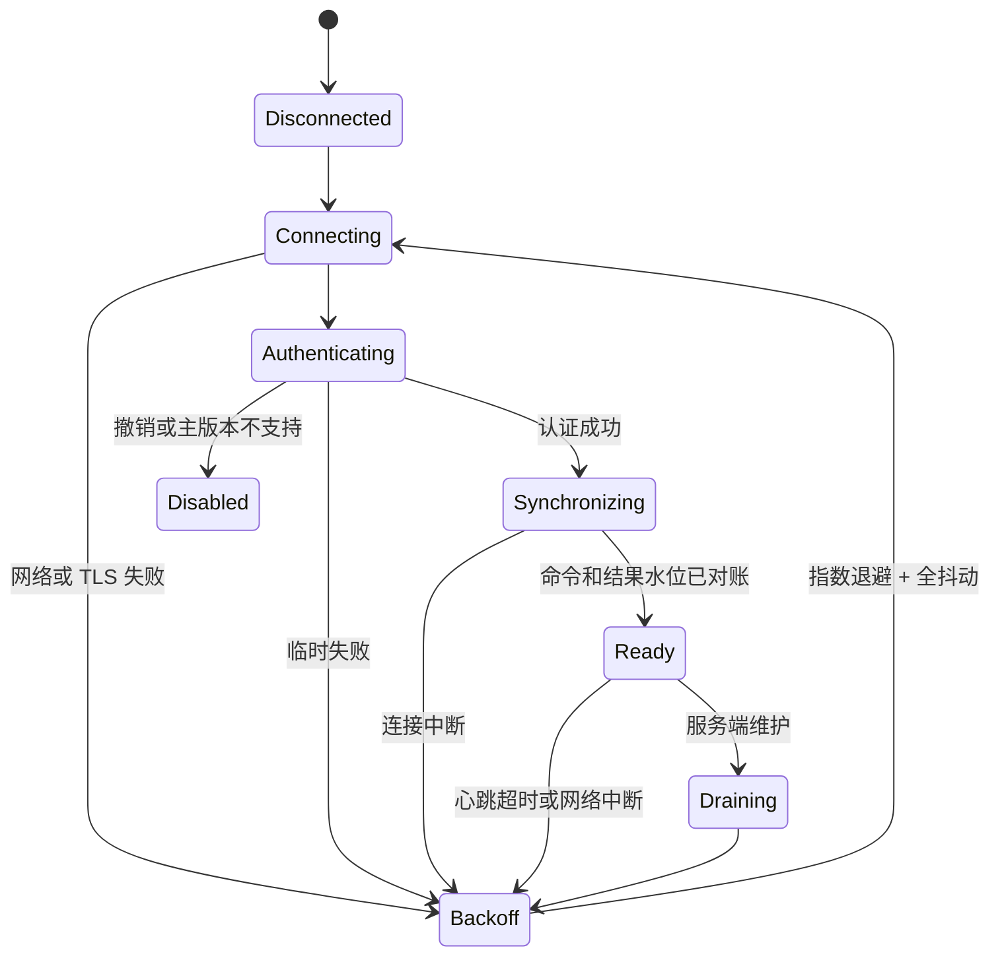

# WebSocket 长连接模型

> [!warning] Runtime 主链已实现，生产身份与多实例待完成
> Mac Agent 到 WebSocket Relay 的主动 WebSocket、命令投递、结果重放和双 ACK 主链已在 Runtime 阶段 0-6 实现。本页中的公钥 challenge、撤销、generation fencing、生产 WSS 和多实例是阶段 7 目标。iPhone 和 `mobile-web` 不使用本连接；它们通过 Run Server HTTPS、Session SSE 和 Run SSE 通信。

## 1. 唯一连接角色

WebSocket Relay 提供 Agent WSS 端点，例如 `/v1/ws/agent`。Mac Agent 主动建立出站连接并使用设备身份认证。生产环境必须使用 `wss://`，限制握手速率、最大帧、空闲时间和每设备连接数。

## 2. 连接与执行规则

- 同一 `device_id` 同时只有一个有效 `connection_generation`；新连接完成同步后接管，旧连接失去写状态权限。
- Run 身份和命令正文来自 PostgreSQL，不来自瞬时 socket。
- Agent 收到命令后先写 SQLite Inbox，再返回 `run.accepted`。
- Agent 结果先写 SQLite Outbox，再发往 Relay。
- Relay 写入 Redis Result Stream 后返回 `received_ack`；PostgreSQL 提交后返回 `durable_ack`。
- 只有 `durable_ack` 允许 Agent 删除 SQLite Outbox。
- 连接中断不能自动创建第二个 Run，也不能盲目启动第二个 Codex Turn。

## 3. 状态机

## 4. 背压与恢复

- 每个 Agent 使用有界收发队列；控制、终态和 ACK 高于文本 delta。
- 文本 delta 可以有界合并，不能丢弃 Item、Tool 或最终结果。
- Redis 或 Result Persister 不可用时，Agent SQLite Outbox 持续保存到容量上限，并明确报告背压。
- Agent 重连时上报未确认 Run 与 `agent_sequence`；Run Server 根据 PostgreSQL `last_durable_agent_sequence` 请求重放。
- 重连使用带全抖动的指数退避；设备撤销、密钥缺失和不兼容主版本不得无限重试。
- Relay 计划停机时进入 draining，停止领取新命令，完成已接收结果写入后再关闭连接。

## 5. 明确排除

- 不提供客户端 `/v1/ws/client`。
- 不通过 WebSocket 保存客户端阅读游标。
- 不让慢客户端拖慢 Agent 结果写入。
- 不用 Redis TTL 锁或 socket 存活代替 PostgreSQL Run 状态。
- 不在本阶段加入周期 Reconciler。

## 6. 文档与 Apifox 门禁

- Agent WSS 的消息 Schema、方向、ACK、错误和可复制示例必须由 `relay-server` 版本化维护。
- 每次变化同时更新本页、JSON Schema、Fixtures、服务端/Agent 契约测试和 Apifox WebSocket 描述。
- 已实现的 Agent WebSocket 主链与尚未实现的生产认证/generation 字段必须在 Apifox 中区分 Current 与 Draft，Draft 不得覆盖当前 `/ws/agent` Current 接口。
- 同步流程和验收记录格式见 [[Run Server HTTPS 与 SSE 接口规范#17. Apifox 同步规范]]。
