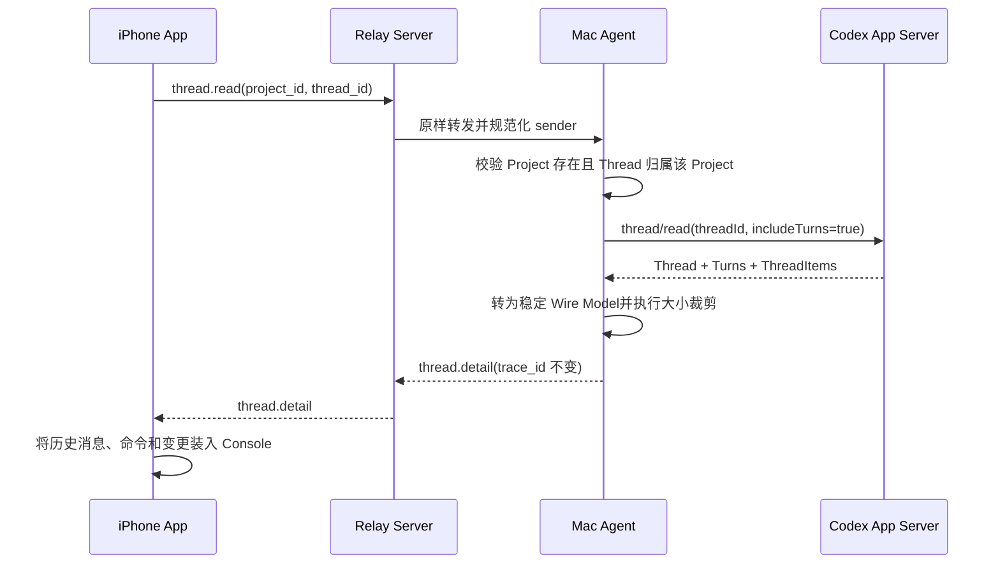

# 会话历史读取

> [!warning] 仅描述当前 MVP
> 本页的 `thread.read -> thread.detail` WebSocket 是 `spec_version: "2.0"` 现状。目标 Runtime 的客户端只通过 Run Server HTTP 快照与 SSE 读取，Bootstrap Sync 才由 Agent 批量调用 Codex `thread/read`，见 [[可靠多端会话与运行时控制面升级方案]]。

## 结论

MVP 使用 Codex Remote 自己的 `thread.read -> thread.detail` 消息读取一个 Codex 会话的完整持久化历史。Mac Agent 在内部调用 Codex App Server 的稳定 `thread/read`，参数固定为：

```json
{
  "threadId": "019fe7da-7105-7831-8c0c-8997786ddd3f",
  "includeTurns": true
}
```

Codex 官方将 `thread/read` 列为稳定 Thread API；它只读取存储中的 Thread，不恢复执行，也不会订阅运行事件。此前讨论的 `thread/turns/list` 属于另一条实验性分页接口，MVP 不依赖它。

官方参考：[Codex App Server](https://learn.chatgpt.com/docs/app-server)

## 端到端流程



## 请求

`project_id` 来自 `project.snapshot.projects[].id`；`thread_id` 来自对应项目的 `thread.snapshot.threads[].id`。两者都必填。

```json
{
  "spec_version": "2.0",
  "message_id": "77777777777747778777777777777777",
  "type": "thread.read",
  "occurred_at": "2026-08-10T08:30:04Z",
  "trace_id": "88888888888848888888888888888888",
  "sender": { "kind": "user", "id": "iphone" },
  "payload": {
    "project_id": "project_9e8638437f803c29d91a3844",
    "thread_id": "019fe7da-7105-7831-8c0c-8997786ddd3f"
  }
}
```

> [!important] 项目边界
> Mac Agent 不信任 App 提供的组合。即使两个 ID 都真实存在，只要 Thread 不属于该 Project，请求也会以 `turn.rejected/THREAD_READ_FAILED` 失败。

## 响应

`thread.detail` 使用与请求相同的 `trace_id` 和新的 `message_id`。主要层级：

| 层级 | 关键字段 |
| --- | --- |
| payload | `project_id`、`thread`、`truncated` |
| thread | 元数据与 `turns[]` |
| turn | `id`、`status`、时间、耗时、错误、`items[]`、`truncated` |
| item | `id`、`type`、按类型出现的内容字段、`truncated` |

常见 Item 类型和 App 用法：

| `type` | 主要字段 | App 展示 |
| --- | --- | --- |
| `userMessage` | `role: user`、`text` | 用户消息 |
| `agentMessage` | `role: assistant`、`phase`、`text` | AI 回复 |
| `plan`、`reasoning` | `text` | 计划或推理摘要 |
| `commandExecution` | `command`、`cwd`、`output`、`exit_code` | 命令与输出 |
| `fileChange` | `changes[].path/kind/diff` | 文件变更 |
| 工具类 Item | `name`、`status`、`duration_ms` | 工具执行 |
| `webSearch` | `query` | 搜索活动 |
| 图片类 Item | `path` | 本地结果路径 |

未知 Item 类型不会导致整个响应失败；Mac Agent 保留它的 `id` 和 `type`，iPhone 可以暂不展示。

## 大小边界

- Relay 单个 WebSocket 消息上限为 256 KiB。
- Mac Agent 把较大的文本、命令、输出、查询、路径、错误或 Diff 字段限制为 24 KiB。
- `thread.detail.payload` 目标上限为 200 KiB，给 Envelope 和序列化开销留余量。
- 超限时优先保留最新 Turn；较早 Turn 或 Item 会被省略。
- 字段裁剪使用 Item 的 `truncated`；Turn 内省略使用 Turn 的 `truncated`；全局省略使用顶层 `truncated`。

> [!note] MVP 边界
> 当前没有历史分页和 Artifact 下载。后续可在不改变 `thread.read -> thread.detail` 基本语义的前提下增加 cursor 或独立 Artifact，但预发布阶段不承诺 Wire 兼容。

## 错误

| code | 含义 |
| --- | --- |
| `MESSAGE_INVALID` | 缺少 `project_id` 或 `thread_id`，或 payload 不能解析 |
| `AGENT_OFFLINE` | Relay 当前没有 Mac Agent |
| `THREAD_READ_FAILED` | Project 不存在、Thread 不属于 Project，或 Codex `thread/read` 失败 |

## 手动验证

```bash
cd /path/to/codexremote/relay-server
./bin/relayctl projects
./bin/relayctl threads --project PROJECT_ID
./bin/relayctl thread --project PROJECT_ID --thread THREAD_ID
```

Apifox 中在 `/ws/app` 发送 `thread.read`，应在同一连接收到 `thread.detail`。完整 JSON 示例维护在 Relay 仓库的 `protocol/fixtures/thread.read.json` 与 `protocol/fixtures/thread.detail.json`。
