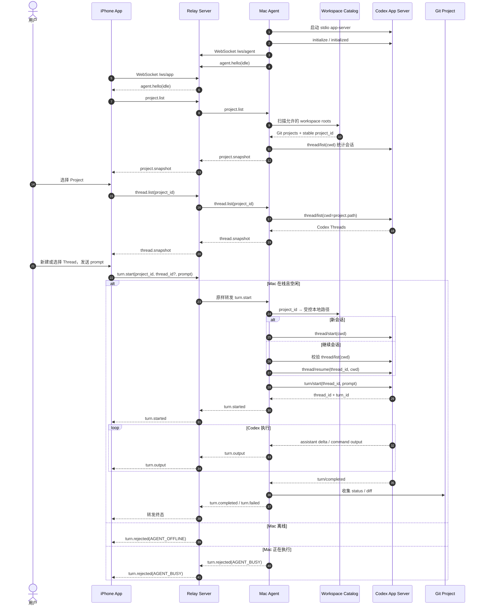
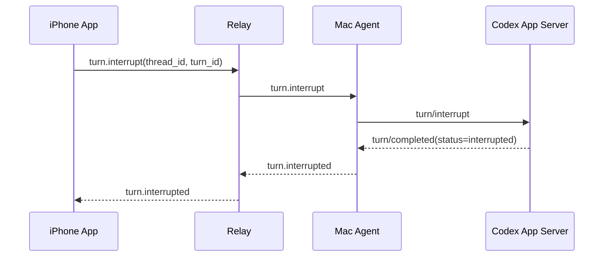

# 端到端任务时序图

> [!abstract] 图示范围
> 展示 iPhone 获取多个项目、选择 Codex 会话并执行一个 Turn 的 MVP 完整路径。Relay 全程只转发消息。

> [!warning] 仅描述当前 MVP
> 本页不是下一阶段的实现蓝图。目标架构已经改为客户端 HTTPS + Session/Run SSE、PostgreSQL Runtime、Redis 实时结果层和 Agent SQLite 重放，见 [[可靠多端会话与运行时控制面升级方案]]。旧 MVP 未被迁移前，本页继续作为现状证据保留。

## 中断分支

## 关键边界

- Relay 不读取 `project_id` 对应路径，也不调用 Codex。
- Mac Agent 是路径授权的最终边界，项目不在 Catalog 中就拒绝。
- Thread 归属通过 Codex 返回的 `cwd` 校验，不能跨项目恢复。
- MVP 不持久化业务 Task；Codex Thread 历史仍由 Codex 自己保存。
- 断线恢复使用 `project.list`、`thread.list` 和 `turn.snapshot`，不保证完整日志重放。
