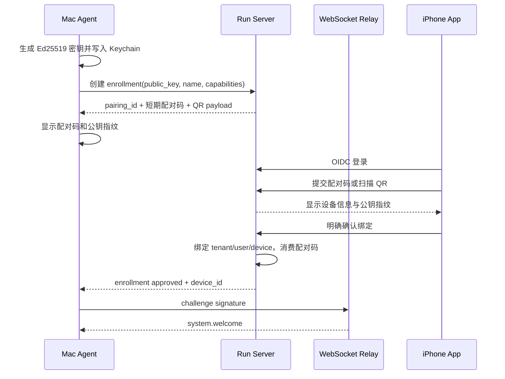
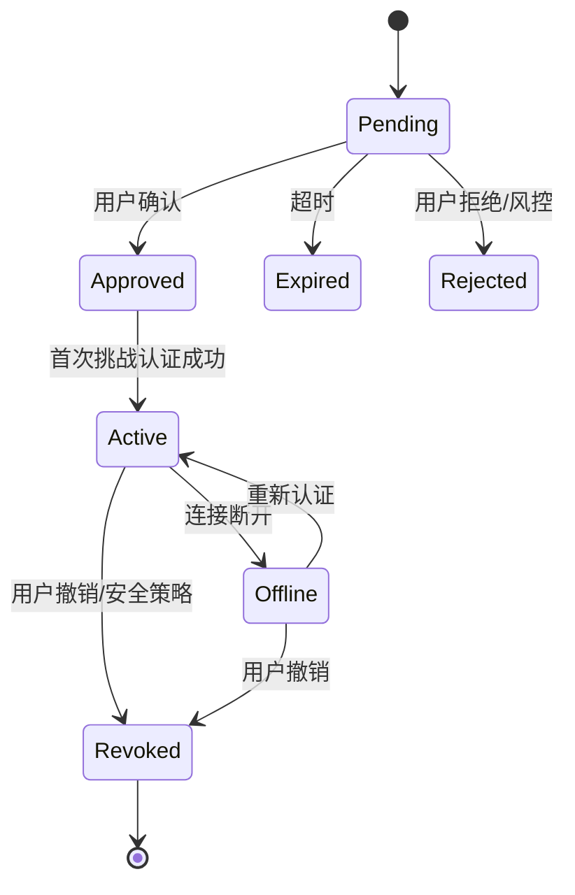

# 设备注册机制

> [!important] 2026-08-22 身份边界修订
> 设备身份拆为两类：Mobile Web/iPhone 使用一次性 Pairing Grant、短期 Access Token 和可轮换 Refresh Session；Mac Agent 仍使用本页的公钥机器身份。客户端配对与 Gateway 边界见 [[Mobile Web Gateway 与 Runtime 鉴权架构#3. Runtime Auth 模型]]。两类身份不得共享 Refresh Token、密钥或撤销状态。

> [!warning] 尚未实现
> 当前 Runtime v1仍无应用层鉴权，只允许在可信局域网运行。单 Owner Runtime Auth将使用独立 `auth` Schema和中间件；OIDC、租户与通用用户管理仍是未来多用户能力，不是首期 Pairing 的前置条件。

## 1. 身份模型

用户、客户端设备和执行机器身份分离：

- **Runtime Owner**：首期由 Mac 本机创建 Pairing Grant表达授权；未来多用户时再接入 OIDC，并由 Admin Platform管理通用用户资料。
- **客户端设备身份**：Mobile Web/iPhone通过一次性 Pairing Code建立可撤销 Session，使用短期 Access Token和轮换 Refresh Token。
- **Mac Agent 身份**：由 Mac 本地 Ed25519 私钥证明，Relay保存对应公钥与 `device_id`。
- **设备绑定**：客户端设备绑定到 Runtime Owner；Mac Agent公钥绑定到受控执行机器，两种绑定分别授权。

设备名称、主机名、IP 地址和序列号都不是认证凭据。

## 2. Mac Agent 首次注册流程



配对码建议 10 分钟过期、一次性使用、足够熵且按 IP/用户/enrollment 限流。QR 只包含短期 enrollment 引用和校验信息，不包含私钥或长期 Token。

## 3. 注册状态



`Revoked` 是服务端持久状态。被撤销设备的所有 Session 立即关闭、未开始租约失效，重新使用必须生成新的 enrollment；不能只把状态改回 Active。

## 4. 每次连接认证

Relay 下发短期随机 nonce 和连接 ID。Agent 对规范化 transcript 签名，Relay 用登记公钥验证。nonce 一次性、短期有效，并在验证后立即消费。

建议 transcript：

```text
AI-CODING-REMOTE-DEVICE-AUTH-V1\n
device_id=<device_id>\n
connection_id=<connection_id>\n
audience=<relay-host>\n
nonce=<base64url_nonce>\n
expires_at=<rfc3339_utc>\n
```

域分隔符和 audience 防止跨协议、跨环境重放。完整连接流程见 [[WebSocket 长连接模型#1. 唯一连接角色]]。

## 5. 本地密钥保护

- 私钥存入 macOS Keychain，文件系统只保存不可用作认证的 key ID。
- 日志禁止打印私钥、签名原文、完整配对码或用户 Token。
- Keychain 项目使用独立 service/account 名称和最小访问控制。
- Keychain 丢失或迁移失败时必须重新配对，不能从 Relay 下载私钥。
- 支持密钥轮换：旧密钥签名轮换请求，新公钥经 Relay 确认后切换；旧密钥设置短暂回滚窗口后撤销。

## 6. 项目注册与设备注册分离

设备已注册不代表它的所有目录都可远程执行。用户必须在 Mac 本地运行类似：

```text
agentctl project add /Users/me/work/example
```

Agent 生成稳定 `project_id` 并保存 `project_id -> canonical local path` 的本地映射，只向 Relay 上报项目显示名、仓库指纹和能力。任务只携带 `project_id`，Mac Agent 在每次执行前重新解析并验证真实路径仍在白名单中。

> [!danger] 路径注入
> Relay 和 iPhone 永远不能通过任务字段指定任意绝对路径。即使项目 ID 合法，也要防止符号链接或目录移动使路径逃逸出授权根目录。

## 7. 撤销与丢失设备

用户可以在 iPhone 撤销设备。Run Server 与 WebSocket Relay 应：

1. 标记设备公钥已撤销并记录审计事件。
2. 关闭所有该设备 Session。
3. 取消未开始任务的租约，运行中任务标记为取消请求或失联待对账。
4. 拒绝后续挑战认证和事件上传。
5. 保留历史任务归属，但不暴露已过期 Artifact 的下载权限。

## 8. 注册数据模型

| 实体 | 关键字段 |
| --- | --- |
| `devices` | `id`, `tenant_id`, `display_name`, `status`, `agent_version`, `last_seen_at` |
| `device_keys` | `id`, `device_id`, `algorithm`, `public_key`, `fingerprint`, `revoked_at` |
| `enrollments` | `id`, `public_key`, `code_hash`, `expires_at`, `attempts`, `approved_by` |
| `device_capabilities` | `device_id`, `executor`, `version`, `features`, `reported_at` |
| `projects` | `id`, `device_id`, `display_name`, `repo_fingerprint`, `status` |
| `audit_events` | `actor`, `action`, `resource`, `ip`, `occurred_at`, `trace_id` |

配对码只保存强哈希或 HMAC，不以明文落库。
